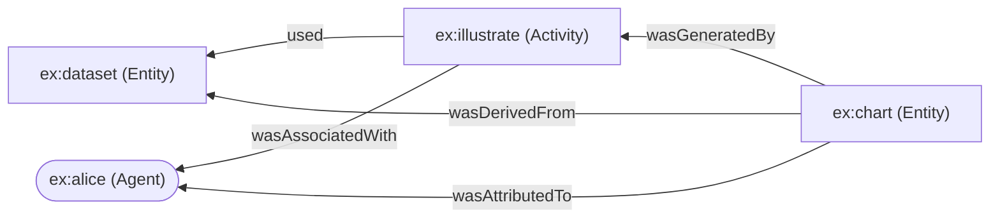

# The tsprov Guide

> **tsprov** is an idiomatic TypeScript implementation of the
> [W3C PROV Data Model](https://www.w3.org/TR/prov-dm/) — a faithful port of the Python
> [`prov`](https://github.com/trungdong/prov) library. It lets you describe *where data came from*
> — the entities, activities, and agents behind it — and round-trip those descriptions through
> PROV-JSON and PROV-N with a fully-typed, fluent API.

---

## Contents

1. [Provenance & the W3C PROV model](#1-provenance--the-w3c-prov-model)
2. [What tsprov is](#2-what-tsprov-is)
3. [Installation](#3-installation)
4. [A complete example](#4-a-complete-example)
5. [The data model in depth](#5-the-data-model-in-depth)
6. [Serialization](#6-serialization)
7. [Transformations](#7-transformations)
8. [Relationship to the Python `prov` library](#8-relationship-to-the-python-prov-library)
9. [How it's built](#9-how-its-built)
10. [Scope](#10-scope)
11. [Development](#11-development)
12. [References](#12-references)

---

## 1. Provenance & the W3C PROV model

**Provenance** is the record of *what happened* to produce a piece of data: which **things** were
involved, the **processing** that used and generated them, and the **people or software** responsible.
It answers questions like *“where did this chart come from, who made it, and from what?”* — which is
the backbone of reproducibility, auditing, trust, and data lineage.

The [**W3C PROV**](https://www.w3.org/TR/prov-overview/) family of specifications (a W3C
Recommendation since 2013) standardises how to express this. Its conceptual core is the **PROV Data
Model** ([PROV-DM](https://www.w3.org/TR/prov-dm/)), built from **three types** and the **relations**
between them:

| Type | What it is | Examples |
|------|------------|----------|
| **Entity** | A thing — physical, digital, or conceptual. | a dataset, a document, a chart, a web page |
| **Activity** | Something that happens over time, acting on or with entities. | a computation, an edit, a publication |
| **Agent** | Something bearing responsibility. | a person, an organisation, a piece of software |

These are connected by relations such as an entity *was generated by* an activity, an activity *used*
an entity, an entity *was derived from* another, an entity *was attributed to* an agent, and an
activity *was associated with* an agent. Everything is identified by a **qualified name**
(`prefix:localpart`, e.g. `ex:chart`) backed by **namespaces**, and provenance can be grouped into
named **bundles**.

PROV defines several interchange syntaxes; tsprov implements the two text-friendly ones:

- **[PROV-N](https://www.w3.org/TR/prov-n/)** — a compact, human-readable notation.
- **[PROV-JSON](https://openprovenance.org/prov-json/)** — a JSON encoding.

(PROV also has [PROV-O](https://www.w3.org/TR/prov-o/) for RDF/OWL and a PROV-XML encoding; those are
out of scope here — see [§10](#10-scope).)

---

## 2. What tsprov is

tsprov is a **TypeScript port of the Python [`prov`](https://github.com/trungdong/prov) library**
(by Trung Dong Huynh — [docs](https://prov.readthedocs.io/), [PyPI](https://pypi.org/project/prov/)),
the de-facto reference implementation of PROV-DM. The Python library is the **specification we ported
against**: its behaviour and its 398-file PROV-JSON conformance corpus drive this implementation.

The goal was **not** a line-by-line transliteration but a *redesign that feels native to TypeScript*
while preserving PROV-DM semantics exactly:

- **A fully-typed fluent API.** Autocomplete on `doc.wasGeneratedBy(...)`, branded qualified names,
  typed attribute bags.
- **Value-equality that actually works.** `doc.equals(other)` is content-based — the single hardest
  thing to get right when porting a Python library that keys dicts/sets on `__hash__`/`__eq__` (see
  [§9](#how-it-works-the-value-equality-trick)).
- **A dependency-light, browser-safe core.** Only [luxon](https://moment.github.io/luxon/) (for
  datetime fidelity). Dual ESM + CJS, tree-shakeable.

---

## 3. Installation

```bash
npm install tsprov      # or: pnpm add tsprov / yarn add tsprov / bun add tsprov
```

This pulls in **luxon** (the only runtime dependency). tsprov ships **dual ESM + CJS** with `.d.ts`
declarations, so it works in Node, Bun, browsers/bundlers, and both `import` and `require`:

```ts
import { ProvDocument } from "tsprov";        // ESM
```
```js
const { ProvDocument } = require("tsprov");   // CommonJS
```

No build step or peer dependencies are required to consume it.

---

## 4. A complete example

Imagine Alice illustrates a chart from a dataset. The provenance graph:



Build it with the **container API**:

```ts
import { ProvDocument } from "tsprov";

const doc = new ProvDocument();
doc.addNamespace("ex", "https://example.org/");

const dataset = doc.entity("ex:dataset", { "prov:type": "ex:RawData" });
const chart = doc.entity("ex:chart");
const illustrate = doc.activity("ex:illustrate", "2024-03-01T10:00:00Z", "2024-03-01T10:05:00Z");
const alice = doc.agent("ex:alice", { "prov:type": "prov:Person" });

doc.used(illustrate, dataset);
doc.wasGeneratedBy(chart, illustrate, "2024-03-01T10:05:00Z");
doc.wasDerivedFrom(chart, dataset);
doc.wasAssociatedWith(illustrate, alice);
doc.wasAttributedTo(chart, alice);
```

…or the equivalent **fluent record API** (every relation method returns the record, so you can chain):

```ts
const chart = doc
  .entity("ex:chart")
  .wasGeneratedBy(illustrate, "2024-03-01T10:05:00Z")
  .wasDerivedFrom(dataset)
  .wasAttributedTo(alice);
```

### `doc.serialize("provn")`

```
document
  prefix ex <https://example.org/>
  
  entity(ex:dataset, [prov:type="ex:RawData"])
  entity(ex:chart)
  activity(ex:illustrate, 2024-03-01T10:00:00+00:00, 2024-03-01T10:05:00+00:00)
  agent(ex:alice, [prov:type="prov:Person"])
  used(ex:illustrate, ex:dataset, -)
  wasGeneratedBy(ex:chart, ex:illustrate, 2024-03-01T10:05:00+00:00)
  wasDerivedFrom(ex:chart, ex:dataset, -, -, -)
  wasAssociatedWith(ex:illustrate, ex:alice, -)
  wasAttributedTo(ex:chart, ex:alice)
endDocument
```

### `doc.serialize("json")`

```json
{
  "prefix": { "ex": "https://example.org/" },
  "entity": {
    "ex:dataset": { "prov:type": "ex:RawData" },
    "ex:chart": {}
  },
  "activity": {
    "ex:illustrate": {
      "prov:startTime": "2024-03-01T10:00:00+00:00",
      "prov:endTime": "2024-03-01T10:05:00+00:00"
    }
  },
  "agent": { "ex:alice": { "prov:type": "prov:Person" } },
  "used": { "_:id1": { "prov:activity": "ex:illustrate", "prov:entity": "ex:dataset" } },
  "wasGeneratedBy": {
    "_:id2": { "prov:entity": "ex:chart", "prov:activity": "ex:illustrate", "prov:time": "2024-03-01T10:05:00+00:00" }
  },
  "wasDerivedFrom": { "_:id3": { "prov:generatedEntity": "ex:chart", "prov:usedEntity": "ex:dataset" } },
  "wasAssociatedWith": { "_:id4": { "prov:activity": "ex:illustrate", "prov:agent": "ex:alice" } },
  "wasAttributedTo": { "_:id5": { "prov:entity": "ex:chart", "prov:agent": "ex:alice" } }
}
```

### Round-trip

```ts
import { read } from "tsprov";

const json = doc.serialize("json");
const parsed = read(json);          // format auto-detected
doc.equals(parsed);                 // true — content-based equality
```

---

## 5. The data model in depth

### Elements

```ts
doc.entity("ex:report", { "prov:label": "Q3 report" });
doc.activity("ex:compile", startTime, endTime);
doc.agent("ex:alice");
doc.collection("ex:results");        // an entity asserting prov:Collection
```

Each returns a typed record (`ProvEntity` / `ProvActivity` / `ProvAgent`) carrying the relevant fluent
methods.

### Relations

Every PROV relation has a builder on the document/bundle (taking the subject first) **and** a fluent
method on the originating record. The camelCase PROV vocabulary is primary; descriptive aliases
(`generation`, `derivation`, …) exist for parity with the Python API.

| Relation | Builder (and record method) | Reads as |
|----------|-----------------------------|----------|
| Generation | `wasGeneratedBy(entity, activity?, time?)` | an entity was generated by an activity |
| Usage | `used(activity, entity?, time?)` | an activity used an entity |
| Communication | `wasInformedBy(informed, informant)` | an activity was informed by another |
| Start | `wasStartedBy(activity, trigger?, starter?, time?)` | an activity was started by a trigger |
| End | `wasEndedBy(activity, trigger?, ender?, time?)` | an activity was ended by a trigger |
| Invalidation | `wasInvalidatedBy(entity, activity?, time?)` | an entity was invalidated by an activity |
| Derivation | `wasDerivedFrom(generated, used, …)` | an entity was derived from another |
| Attribution | `wasAttributedTo(entity, agent)` | an entity was attributed to an agent |
| Association | `wasAssociatedWith(activity, agent?, plan?)` | an activity was associated with an agent |
| Delegation | `actedOnBehalfOf(delegate, responsible, activity?)` | an agent acted on behalf of another |
| Influence | `wasInfluencedBy(influencee, influencer)` | generic influence |
| Specialization | `specializationOf(specific, general)` | a specific entity specialises a general one |
| Alternate | `alternateOf(a1, a2)` | two entities are alternates |
| Membership | `hadMember(collection, entity)` | a collection had a member |
| Mention | `mentionOf(specific, general, bundle)` | an entity mentioned within a bundle |

Derivation has three convenience subtypes that assert a `prov:type`: `wasRevisionOf`,
`wasQuotedFrom`, and `hadPrimarySource`.

### Qualified names & namespaces

Identifiers are **qualified names** — a `prefix:localpart` string backed by a namespace URI. Register
namespaces, then refer to things by their prefixed name:

```ts
doc.addNamespace("ex", "https://example.org/");
doc.setDefaultNamespace("https://example.org/default/");  // bare names resolve here

doc.entity("ex:thing");   // → https://example.org/thing
doc.entity("thing");      // → https://example.org/default/thing (via the default namespace)
```

QName **identity is by URI** (two prefixes mapping to the same URI are equal); namespace identity
includes the prefix. tsprov enforces this exactly.

### Literals & typed values

Attribute values can be strings, booleans, numbers, datetimes, qualified names, or explicit
`Literal`s. Because JavaScript has a single `number` type, wrap a value in a `Literal` to pin its XSD
datatype:

```ts
import { Literal, XSD_INT } from "tsprov";

doc.entity("ex:dataset", {
  "ex:rows": new Literal(10_000, XSD_INT),   // xsd:int
  "ex:ratio": 0.42,                          // bare number → xsd:double
  "ex:public": true,                         // xsd:boolean
});

// Duplicate keys (e.g. multiple prov:type) need the ordered pair-array form:
doc.entity("ex:multi", [
  ["prov:type", "ex:A"],
  ["prov:type", "ex:B"],
]);
```

A language tag makes a literal an internationalised string:

```ts
new Literal("un lieu", undefined, "fr");     // "un lieu"@fr
```

### Bundles & documents

A **document** is the top-level container. A **bundle** is a named set of provenance *inside* a
document — provenance about provenance. Child bundles inherit the document's namespaces:

```ts
const bundle = doc.bundle("ex:bundle1");
bundle.entity("ex:nested");

doc.hasBundles();   // true
doc.bundles;        // [ProvBundle …]
```

### Value equality

`equals()` is **content-based and order-independent** — the heart of correctness:

```ts
const a = new ProvDocument(); a.addNamespace("ex", "https://example.org/");
a.entity("ex:x"); a.entity("ex:y");

const b = new ProvDocument(); b.addNamespace("ex", "https://example.org/");
b.entity("ex:y"); b.entity("ex:x");   // different order

a.equals(b);   // true
```

---

## 6. Serialization

```ts
const json = doc.serialize("json");                  // PROV-JSON
const provn = doc.serialize("provn");                // PROV-N (text)

const fromJson = ProvDocument.deserialize(json, "json");
const auto = read(json);                             // read() probes formats
```

- **PROV-JSON** supports both `serialize` and `deserialize`, and round-trips losslessly under
  `equals()`.
- **PROV-N** is **serialize-only** — there is no standard PROV-N parser, matching the reference
  library (`deserialize("…", "provn")` throws `UnsupportedOperationError`).
- **`read(content, format?)`** returns a `ProvDocument`; with no `format` it auto-detects by trying
  each registered serializer.

---

## 7. Transformations

```ts
doc.flattened();   // a new document with every bundle's records lifted to the top level
doc.unified();     // merge records that share an identifier (within the doc and its bundles)
target.update(other);             // append another document/bundle's records
doc.addBundle(someBundle, id);    // attach an existing bundle under an identifier
```

> Two behaviours are inherited from the reference library: `flattened()` returns the **same**
> document when there are no bundles, and `unified()` **shares** the source's namespace manager. Both
> are documented in [`DEVIATIONS.md`](../DEVIATIONS.md).

---

## 8. Relationship to the Python `prov` library

tsprov mirrors Python `prov` v2.1.1 closely enough that the **entire 398-file PROV-JSON conformance
corpus round-trips** (`deserialize → serialize → deserialize` is `.equals()`-stable). Where the two
necessarily diverge — because of language differences — the differences are deliberate and recorded in
[`DEVIATIONS.md`](../DEVIATIONS.md). The notable ones:

- **`int` vs `double`.** JavaScript has one `number` type, so the precise XSD numeric subtype isn't
  always preserved on programmatic authoring (wrap values in a `Literal` when it matters).
- **Datetime precision.** luxon resolves to milliseconds (not microseconds), and a naive datetime gets
  a zone; bare ISO offsets are otherwise preserved exactly.
- **Determinism.** Attribute storage is insertion-ordered (Python uses unordered `set`s), so tsprov's
  output is *more* deterministic — harmless, since PROV equality is order-independent.
- **Warnings & the builder vocabulary** are adapted to TS idioms (a `setWarningHandler` callback;
  camelCase relation names as the primary API).

> The corpus test verifies **round-trip self-consistency**, not byte-for-byte equality with Python's
> output. A full Python↔TS differential harness is future work.

---

## 9. How it's built

### Project layout

```
src/
  identifier.ts          Identifier · QualifiedName · Namespace (+ branded QName type)
  intern.ts              global intern table (equal QNames/namespaces share one object)
  constants.ts           PROV/XSD namespaces, type & attribute QNames, wiring maps
  literal.ts             Literal + XSD datatype parsing
  datetime.ts            luxon facade (ISO parse/format ≈ Python isoformat)
  value.ts               the AttrValue union + valueKey (the equality primitive)
  format.ts              PROV-N value formatting (incl. the C %g float formatter)
  error.ts               ProvError hierarchy + warning callback
  record/
    attributes.ts        AttributeStore (ordered, value-deduped)
    record.ts            ProvRecord base (add_attributes, equals/key, getProvN)
    element.ts           ProvElement + Entity/Activity/Agent
    relation.ts          ProvRelation + the 15 relation classes
    registry.ts          type-QName → constructor registry
  namespace-manager.ts   prefix/URI resolution, default & anonymous names
  bundle.ts              ProvBundle + the full fluent builder API
  document.ts            ProvDocument (sub-bundles, flatten/unify/update)
  serializers/
    serializer.ts        the Serializer interface + registry
    json.ts              PROV-JSON (serialize + deserialize)
    provn.ts             PROV-N (serialize)
  read.ts                read() with format auto-detection
  index.ts               the public barrel
```

### How it works: the value-equality trick

Python keys its dictionaries and sets on `QualifiedName.__hash__` / `Literal.__hash__` /
`ProvRecord.__hash__`. JavaScript `Map`/`Set` key by **reference**, so a naïve port silently breaks:
two structurally-equal qualified names would never match as keys. tsprov solves this with three
coordinated mechanisms:

1. **Canonical `key` getters** on every value type — a `\u0000`-separated string reproducing the exact
   Python hash inputs (e.g. a `QualifiedName`'s key is its URI; a `Literal`'s is
   `value␀datatype␀langtag`).
2. **A global intern table** so equal namespaces/qualified names become the *same object* — constants
   like `PROV_ENTITY` are singletons.
3. **Explicit `equals()`** for the mutable cases (records, bundles), with every collection keyed by a
   canonical string rather than by object identity.

This is why the record hierarchy is **class-based** (not a discriminated union): the fluent API,
`copy()` dispatch through the registry, and static `FORMAL_ATTRIBUTES` all want real classes with
methods.

The full design rationale lives in [`docs/migration/`](migration/) (the analysis that preceded the
port), and the implementation history in
[`docs/migration/05-progress-log.md`](migration/05-progress-log.md).

---

## 10. Scope

**Included (v1):** the complete in-memory PROV-DM model; the fluent authoring API; **PROV-JSON**
(serialize + deserialize) and **PROV-N** (serialize); `read()` auto-detection; content-based
`equals()`; bundles, `flattened`, `unified`, `update`.

**Not included:** PROV-XML, PROV-RDF / PROV-O, graph/DOT visualisation, and a CLI. These are tracked
as post-v1 milestones in the [migration roadmap](migration/02-migration-roadmap.md) and would ship
behind optional subpath exports so the core stays dependency-light.

---

## 11. Development

```bash
bun install
bun test            # full suite, incl. the 398-file PROV-JSON corpus round-trip oracle
bun run build       # emit dist/ (ESM + CJS + .d.ts)
```

The Python reference library and its conformance corpora are vendored under `reference/prov/` and used
as the test oracle.

---

## 12. References

- **W3C PROV overview** — <https://www.w3.org/TR/prov-overview/>
- **PROV-DM** (data model) — <https://www.w3.org/TR/prov-dm/>
- **PROV-N** (notation) — <https://www.w3.org/TR/prov-n/>
- **PROV-O** (RDF/OWL) — <https://www.w3.org/TR/prov-o/>
- **PROV-JSON** — <https://openprovenance.org/prov-json/>
- **Python `prov`** (the reference implementation) — <https://github.com/trungdong/prov> ·
  [docs](https://prov.readthedocs.io/) · [PyPI](https://pypi.org/project/prov/)

---

## License

Apache-2.0.
