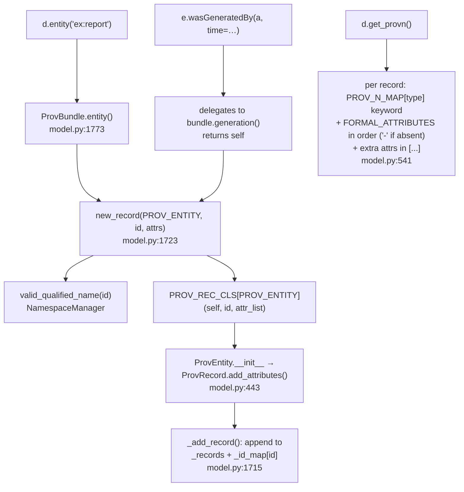
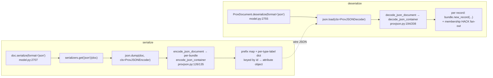
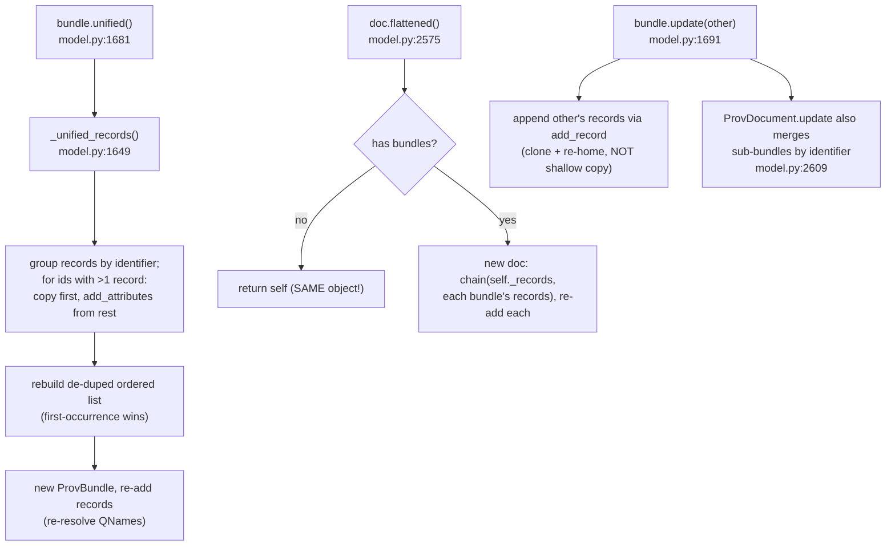

# 01 — Codebase Analysis: the Python `prov` library

> The definitive map of the migration **source**: the Python library [`prov`](https://github.com/trungdong/prov) v2.1.1 (W3C PROV Data Model). This document is the shared reference for the whole `tsprov` migration. Sibling docs: [02-migration-roadmap.md](02-migration-roadmap.md), [03-dependency-analysis.md](03-dependency-analysis.md), [04-typescript-feasibility.md](04-typescript-feasibility.md).
>
> Source root analysed: `/Users/s-ved/repos/inflexa/tsprov/reference/prov/src/prov` (~5,800 LOC core, excluding tests/golden corpora). All `file:line` anchors are relative to that root unless prefixed otherwise. Claims marked **VERIFY** were not directly re-confirmed against source during this pass.

---

## 1. Executive summary

`prov` is a complete in-memory implementation of the **W3C PROV Data Model** (PROV-DM) plus its four standard interchange formats. PROV-DM describes *provenance*: a graph of how things came to be, expressed with three element kinds and a fixed vocabulary of relations between them.

### 1.1 PROV-DM concepts implemented

| Concept | PROV-DM meaning | Implementing class | Anchor |
|---|---|---|---|
| **Entity** | A physical/digital/conceptual thing | `ProvEntity` | model.py:663 |
| **Activity** | Something occurring over time, acting on/with entities | `ProvActivity` | model.py:778 |
| **Agent** | Something bearing responsibility | `ProvAgent` | model.py:999 |
| **Relations** (15 classes) | Generation, Usage, Communication, Start, End, Invalidation, Derivation, Attribution, Association, Delegation, Influence, Specialization, Alternate, Membership (the 14 direct `ProvRelation` subclasses) + `Mention` (which subclasses `ProvSpecialization`) | `ProvRelation` subclasses | model.py:925–1099 |
| **Qualified Name** | `prefix:localpart` identifier resolving to a URI | `QualifiedName` | identifier.py:54 |
| **Namespace** | `(prefix, uri)` pair | `Namespace` | identifier.py:107 |
| **Literal** | typed/lang-tagged value | `Literal` | model.py:148 |
| **Bundle** | A named set of PROV statements | `ProvBundle` | model.py:1373 |
| **Document** | Top-level container of statements + bundles | `ProvDocument` | model.py:2500 |

### 1.2 Scope, formats, LOC

The library is bidirectional for three formats and serialize-only for one:

| Format | Module | Serialize | Deserialize | Heavy dep |
|---|---|---|---|---|
| PROV-JSON | serializers/provjson.py (340 LOC) | ✓ | ✓ | none (stdlib `json`) |
| PROV-N | serializers/provn.py (32 LOC) | ✓ | ✗ (`NotImplementedError`) | none |
| PROV-XML | serializers/provxml.py (433 LOC) | ✓ | ✓ | `lxml` (optional extra) |
| PROV-RDF / PROV-O | serializers/provrdf.py (759 LOC) | ✓ | ✓ | `rdflib` (optional extra) |

> **`dateutil` is a CORE, unconditionally-required runtime dependency**, not an RDF-specific extra: it is imported top-level at model.py:31 and used by `_ensure_datetime`/`parse_xsd_datetime` (model.py:67, :74) for all datetime ingestion. provrdf.py:11 also imports it, but the primary use is the core model. In pyproject.toml `networkx` and `pydot` are likewise declared as non-extra (core) deps, yet are used only by the optional leaf modules `graph.py`/`dot.py` — i.e. "core-declared but functionally optional".

Plus two optional adapters: `graph.py` (113 LOC, networkx) and `dot.py` (409 LOC, pydot/Graphviz), and two thin CLIs (`scripts/convert.py`, `scripts/compare.py`).

**Approximate LOC by module** (the migration-relevant core):

```
model.py        2838   ← CORE: records, Literal, bundle/document, namespace mgr
provrdf.py       759   optional RDF
provxml.py       433   optional XML
dot.py           409   optional viz
provjson.py      340   PROV-JSON (priority)
constants.py     216   PROV/XSD QName constants + wiring maps
scripts/convert  204   CLI
identifier.py    191   Identifier / QualifiedName / Namespace (foundation)
scripts/compare  151   CLI
graph.py         113   optional graph
serializers/__   87    Serializer ABC + Registry
__init__.py      58    Error base + read()
provn.py         32    PROV-N (serialize only)
```

The single most important fact for the port: **the entire library is built on value-object equality and hashing of `QualifiedName`/`Literal`/`ProvRecord`.** Python `dict`/`set` key these objects by `__hash__`/`__eq__` (value semantics); JS `Map`/`Set` key by reference. Reproducing value semantics — by canonical string keys or a global intern table — is the central migration concern and recurs in every section below. See [04-typescript-feasibility.md](04-typescript-feasibility.md) for the chosen strategy.

---

## 2. System mindmap

### 2.1 Module dependency DAG

Internal dependency order (leaves first): `identifier → constants → model → serializers → {json, provn, xml, rdf}`, with `model → graph → dot`, and CLIs/`read()` at the top.

```mermaid
graph TD
    identifier[identifier.py<br/>Identifier · QualifiedName · Namespace]
    constants[constants.py<br/>PROV/XSD QNames · wiring maps]
    model[model.py<br/>Literal · ProvRecord · ProvBundle · ProvDocument · NamespaceManager]
    serinit[serializers/__init__.py<br/>Serializer ABC · Registry · get]
    provn[serializers/provn.py]
    provjson[serializers/provjson.py]
    provxml[serializers/provxml.py]
    provrdf[serializers/provrdf.py]
    graph[graph.py<br/>prov ↔ MultiDiGraph]
    dot[dot.py<br/>prov → DOT]
    pkginit[__init__.py<br/>Error · read]
    convert[scripts/convert.py]
    compare[scripts/compare.py]

    constants --> identifier
    model --> constants
    model --> identifier
    serinit --> model
    provn --> serinit
    provjson --> serinit
    provxml --> serinit
    provrdf --> serinit
    provn --> model
    provjson --> model
    provxml --> model
    provrdf --> model
    graph --> model
    dot --> graph
    dot --> model
    pkginit --> model
    pkginit --> serinit
    convert --> model
    convert --> serinit
    convert -.lazy.-> dot
    compare --> model

    subgraph optional_heavy [optional / heavy external deps]
        provxml
        provrdf
        graph
        dot
    end
```

Note the **lazy import boundaries** that exist purely to break cycles or keep heavy deps optional:
- `serializers/__init__.py` imports the four concrete serializers lazily inside `Registry.load_serializers()` (model ↔ serializers cycle). The `class Registry:` is serializers/__init__.py:55, `def load_serializers` is :61, and the four `from ... import` statements are serializers/__init__.py:62–67.
- `model.py` lazily imports `serializers` inside `serialize`/`deserialize` and `prov.dot` inside `plot()`.
- `__init__.py`'s `read()` lazily imports `ProvDocument` and `Registry`. __init__.py:23+.
- `convert.py` lazily imports `prov.dot.prov_to_dot` (Graphviz optional). convert.py:87+.

Note also a real porting constraint: `provxml.py` and `provrdf.py` fail **hard at import time** if `lxml`/`rdflib` are absent — they `from lxml import etree` (provxml.py:4) and `from rdflib... import ...` (provrdf.py:13–16) at top level. So they cannot be made truly lazy/optional in the port without isolating those imports behind a dynamic boundary.

### 2.2 Textual outline mindmap

```
prov (W3C PROV Data Model in Python)
├── Foundation (value objects)
│   ├── Identifier            — wraps a URI; also xsd:anyURI literal type
│   ├── QualifiedName         — (Namespace, localpart); the UNIVERSAL key
│   └── Namespace             — (prefix, uri) + per-instance QName cache/factory
├── Constants (the PROV vocabulary)
│   ├── PROV / XSD / XSI namespace singletons
│   ├── Every PROV_* type QName, PROV_ATTR_* attribute QName, XSD_* datatype QName
│   └── Wiring maps: PROV_N_MAP, ADDITIONAL_N_MAP, PROV_BASE_CLS,
│       PROV_ATTRIBUTE_QNAMES / _LITERALS / PROV_ATTRIBUTES, + inverses
├── Model (the data layer — model.py)
│   ├── Helpers      — parse_xsd_datetime, parse_boolean, parse_xsd_types,
│   │                  first, encoding_provn_value, _ensure_datetime
│   ├── Literal      — value/datatype/langtag value object
│   ├── Exceptions   — ProvException, ProvWarning, …InvalidQualifiedName,
│   │                  …ElementIdentifierRequired
│   ├── Records
│   │   ├── ProvRecord (abstract)
│   │   ├── ProvElement → ProvEntity / ProvActivity / ProvAgent
│   │   └── ProvRelation → 14 direct subclasses + ProvMention ⊂ ProvSpecialization (15 relation classes total)
│   ├── Registry     — PROV_REC_CLS: type QName → record class
│   ├── NamespaceManager — prefix↔Namespace resolution, renaming, anon ids
│   ├── ProvBundle   — record store + the FLUENT FACTORY API + equality/unify/update
│   └── ProvDocument — ProvBundle + named sub-bundles + serialize/deserialize
├── Serializers
│   ├── Serializer ABC + Registry + get(format) + DoNotExist
│   ├── PROV-JSON (priority, self-contained)
│   ├── PROV-N    (serialize-only; delegates to get_provn)
│   ├── PROV-XML  (lxml; optional)
│   └── PROV-RDF  (rdflib; optional, the hardest — note dateutil is a CORE dep, not RDF-specific)
├── Adapters (optional)
│   ├── graph.py — prov ↔ networkx.MultiDiGraph
│   └── dot.py   — prov → pydot.Dot (Graphviz)
├── Package root — Error base + read() format autodetect
└── CLIs — prov-convert, prov-compare
```

---

## 3. Module-by-module breakdown

### 3.1 `identifier.py` (191 LOC) — value-type foundation

**Responsibility:** the three immutable value objects whose equality/hashing the whole library depends on.

| Member | Anchor | Notes |
|---|---|---|
| `Identifier` | identifier.py:8 | wraps `_uri = str(uri)`; `__eq__` compares `.uri` only when `isinstance(other, Identifier)` else `False` (not `NotImplemented`); `__hash__ = hash((uri, __class__))` — **class is in the hash**. identifier.py:35–39 |
| `Identifier.provn_representation` | identifier.py:44 | emits `'"uri" %% xsd:anyURI'` (the `%%%%` in source is `%`-format escaping for a literal `%%`). identifier.py:51 |
| `QualifiedName` | identifier.py:54 | URI = `namespace.uri + localpart`; display `_str = prefix:localpart` or just `localpart` when prefix is falsy. identifier.py:76–81 |
| `QualifiedName.__hash__` | identifier.py:99 | **overrides to `hash(self.uri)` only** — drops the class component. Combined with inherited `__eq__`, two QNames are equal *and* hash-equal iff their URIs match → **prefix is irrelevant to QName identity**. |
| `QualifiedName.provn_representation` | identifier.py:102 | wraps display string in single quotes: `'prefix:local'`. |
| `Namespace` | identifier.py:107 | `(prefix, uri)`; raises `ValueError` if uri is falsy/whitespace; `__eq__`/`__ne__`/`__hash__` keyed on **`(uri, prefix)` — prefix DOES count** for Namespace identity. |
| `Namespace.__getitem__` | identifier.py:185 | the per-instance memoization cache: `ns['localpart']` returns the same `QualifiedName` object each call. This is how constants.py mints `PROV['Entity']` etc. |
| `Namespace.qname` / `contains` | — | normalize `str | Identifier` to a uri; `qname` strips the namespace uri prefix via `uri[len(self._uri):]`. |

**Used by:** everything. `constants.py` mints all constants from these; `model.py` keys `_attributes` by `QualifiedName`; serializers stringify QNames; `NamespaceManager` mints them via `Namespace.__getitem__`.

**Identity asymmetry to preserve (or deliberately unify):** Namespace identity = `(uri, prefix)`; QualifiedName identity = `uri` only. An `Identifier(uri)` and a `QualifiedName(uri)` are `==` (via inherited `__eq__`) but hash *differently* (Identifier mixes in class), so they generally do **not** collide in a dict/set. See identifier.py:35–39 vs 99–100, and [04-typescript-feasibility.md](04-typescript-feasibility.md) §identity.

### 3.2 `constants.py` (216 LOC) — the PROV vocabulary + wiring maps

**Responsibility:** declares the `PROV`/`XSD`/`XSI` `Namespace` singletons (constants.py:7–9) and mints every PROV/XSD QName, then builds the lookup maps that wire types to keywords, base classes, and attribute categories. Every map below is keyed (and several valued) by `QualifiedName` and silently depends on its value-equality.

| Map / constant | Anchor | Shape | Purpose |
|---|---|---|---|
| `PROV_N_MAP` | constants.py:39 | `QName → str` | type QName → PROV-N keyword (`PROV_ENTITY→"entity"`, `PROV_GENERATION→"wasGeneratedBy"`). 19 entries incl. `PROV_BUNDLE`. |
| `ADDITIONAL_N_MAP` | constants.py:63 | `QName → str` | subtype QNames top-level in some formats (`Revision→wasRevisionOf`, `Person→person`, `Collection→collection`, …). |
| `PROV_BASE_CLS` | constants.py:78 | `QName → QName` | extended type → base type. e.g. `PROV['Revision']→PROV_DERIVATION`, `PROV['Plan']/['Collection']/['Bundle']→PROV_ENTITY`, `PROV['Person']→PROV_AGENT`. Used by (de)serializers to collapse subtypes. |
| `PROV_ATTRIBUTE_QNAMES` | constants.py:140 | `set[QName]` | formal attributes whose values are **references** (entity/activity/agent/…/collection). |
| `PROV_ATTRIBUTE_LITERALS` | constants.py:165 | `set[QName]` | `{PROV_ATTR_TIME, _STARTTIME, _ENDTIME}` — formal attributes carrying **datetimes**. |
| `PROV_ATTRIBUTES` | constants.py:168 | `set[QName]` | union of the two above. |
| `PROV_RECORD_ATTRIBUTES` | constants.py:169 | `list[(QName, str)]` | each formal attr paired with its display string. **Order is set-iteration order → nondeterministic; do not promise an order.** |
| `PROV_RECORD_IDS_MAP` | constants.py:171 | `str → QName` | inverse of `PROV_N_MAP`. |
| `PROV_ID_ATTRIBUTES_MAP` | constants.py:174 | `QName → str` | attr QName → display string. |
| `PROV_ATTRIBUTES_ID_MAP` | constants.py:177 | `str → QName` | inverse of the above. |
| `PROV_QUALIFIEDNAME` | constants.py:188 | `QName` | the `prov:QUALIFIED_NAME` datatype. |
| `XSD_ANYURI` | constants.py:192 | `QName` | datatype for URI-valued literals. |

**Used by:** `model.py` (`add_attributes` classification, `get_provn` keyword lookup, `PROV_REC_CLS` keys), every serializer (collapse subtypes, predicate maps), `graph.py`/`dot.py` (style/inference maps).

### 3.3 `model.py` (2838 LOC) — the core

The largest and most important module. Logically four layers:

**(a) Module helpers** — value parsing/formatting:

| Fn | Anchor | Behaviour |
|---|---|---|
| `_ensure_datetime` | model.py:65 | `str → datetime` via `dateutil.parser.parse`; passes through `datetime`/`None`; raises on bad strings. |
| `parse_xsd_datetime` | model.py:72 | like above but returns `None` on `ValueError` (no raise). |
| `parse_boolean` | model.py:80 | tri-state: `false/0→False`, `true/1→True`, else `None`. |
| `parse_xsd_types` | model.py:109 | dispatch a datatype QName through `XSD_DATATYPE_PARSERS`. |
| `XSD_DATATYPE_PARSERS` | model.py:98 | `STRING→str, DOUBLE→float, LONG/INT→int, BOOLEAN→parse_boolean, DATETIME→parse_xsd_datetime, ANYURI→Identifier`. **int/long/double all collapse to JS `number`.** |
| `first` | model.py:117 | `next(iter(a_set), None)` — pulls "the" value of a single-valued attr from a set. |
| `encoding_provn_value` | model.py:132 | runtime-type render for PROV-N: `str→quoted`, `datetime→iso %% xsd:dateTime`, `float→%g %% xsd:float`, `bool→%i %% xsd:boolean`. **isinstance order matters (float before bool; bool ⊂ int in Python).** |

**(b) `Literal`** (model.py:148) — `_value` (always `str`), `_datatype` (QName|None), `_langtag` (str|None). Constructor forces datatype to `PROV_INTERNATIONALIZEDSTRING` when a langtag is present. `__hash__ = hash((value, datatype, langtag))` so identical Literals dedupe inside the `set`-valued attribute storage. `provn_representation()` and value `__eq__`.

**(c) Exceptions** — `ProvException` (model.py:229, ⊂ `prov.Error`), `ProvWarning` (model.py:235, ⊂ `Warning`), `ProvExceptionInvalidQualifiedName` (model.py:241), `ProvElementIdentifierRequired` (model.py:259).

**(d) Records, containers, registry** — covered in §4–§7. The module-level `PROV_REC_CLS` registry (model.py:1101) and `DEFAULT_NAMESPACES` (model.py:1123) live at the boundary of layers (c)/(d).

**Used by:** all serializers, `graph.py`, `dot.py`, CLIs, `read()`. It is the hub of the whole library.

### 3.4 `serializers/__init__.py` (87 LOC)

| Member | Anchor | Notes |
|---|---|---|
| `Serializer` (ABC) | serializers/__init__.py:16 | holds `document`; abstract `serialize(stream, **args)` / `deserialize(stream, **args)`. Stream contract is `io.IOBase`. |
| `DoNotExist` | serializers/__init__.py:49 | ⊂ `prov.Error`; raised by `get()` for unknown formats. |
| `Registry` | serializers/__init__.py:55 | `serializers: dict[str, type[Serializer]]`; `load_serializers()` lazily imports the four concrete classes (cycle break). Registers **classes**, not instances. |
| `get(format_name)` | serializers/__init__.py:77 | returns the class; `KeyError → DoNotExist`. |

`ProvDocument.serialize()` **defaults to `format='json'`** (model.py:2710) and resolves the serializer via `serializers.get(format)` (model.py:2727), so an unknown format raises the specific `DoNotExist` — not a generic error. By contrast, `read()`'s format autodetect (__init__.py:47–53) **swallows ALL exceptions** in its bare-`except: pass` probe loop, raising only a generic `TypeError` if every format fails.

### 3.5 `serializers/provn.py` (32 LOC)

`ProvNSerializer.serialize()` (provn.py:11) delegates entirely to `document.get_provn()` and writes `str` (TextIOBase) or utf-8 bytes. `deserialize()` raises `NotImplementedError`. Trivial to port.

### 3.6 `serializers/provjson.py` (340 LOC) — priority format

PROV-JSON encode/decode, self-contained (only model + constants).

| Member | Anchor | Notes |
|---|---|---|
| `ProvJSONSerializer` | provjson.py:60 | `json.dump(cls=ProvJSONEncoder)` / `json.load(cls=ProvJSONDecoder)`. |
| `ProvJSONEncoder` / `Decoder` | provjson.py:100 / :108 | the stdlib `cls=` hook architecture → in TS, plain `toJSON`/`fromJSON` functions. |
| `AnonymousIDGenerator` | provjson.py:39 | assigns `_:id1, _:id2, …` to record-less records; cache keyed by `ProvRecord` (value hash). |
| `encode_json_container` | provjson.py:135 | the PROV-JSON dict shape: `prefix` map, then per record-type-label a dict keyed by identifier → attribute object; collapses duplicate ids into singleton-or-list. |
| `decode_json_container` | provjson.py:208 | reverse; implements the **multi-entity membership HACK** (a `hadMember` with >1 entity is split into N membership relations). |
| `encode_json_representation` / `decode_json_representation` | provjson.py:296 / :313 | per-value encode/decode; `LITERAL_XSDTYPE_MAP` keyed by Python `float`/`int` types. |
| `literal_json_representation` | provjson.py:334 | langtag → `{'$':v,'lang':l}` (no type); else `{'$':v,'type':str(datatype)}`. |

### 3.7 `serializers/provxml.py` (433 LOC) — optional (lxml)

`ProvXMLSerializer` (provxml.py:37). `serialize_bundle` (provxml.py:78) builds an lxml tree with `nsmap` (None key = default ns; strips trailing `#` from xsd uri), emits one element per record, sorts attrs via `model.sorted_attributes`, and does xsd type inference (`ALWAYS_CHECK` type set, `str(value).startswith('prov:')` hacks, `prov:ref` vs text routing). `deserialize_subtree` (provxml.py:258) walks the tree, maps localname→base record type via `PROV_BASE_CLS`, restores asserted subtypes. Helpers: `xml_qname_to_QualifiedName` (provxml.py:393), `_extract_attributes` (provxml.py:349), `_derive_record_label` (provxml.py:322, mutates attribute list), `_ns`/`_ns_prov`/`_ns_xsi`/`_ns_xml` Clark-notation builders (provxml.py:419).

### 3.8 `serializers/provrdf.py` (759 LOC) — optional (rdflib), the hardest

`ProvRDFSerializer` (provrdf.py:118) over an rdflib `ConjunctiveGraph` (quads → bundles as named graphs). `encode_container` (provrdf.py:261) is the single hardest function to port: deeply nested record-type-specific predicate remapping, `prov:qualifiedX` BNode generation, ALTERNATE subject/object swap, MENTION `asInBundle`, in-place `RDF.type` removal for derivation subtypes. `decode_container` (provrdf.py:531) reverses it using `RELATION_MAP`/`PREDICATE_MAP` dynamic dispatch and `walk()` (provrdf.py:711, a cartesian-product generator that expands multi-valued formal attributes into multiple records). Best validated by the golden corpus, not re-derived.

### 3.9 `graph.py` (113 LOC) — optional (networkx)

`prov_to_graph` (graph.py:59) builds a `MultiDiGraph`: `ProvElement` objects become nodes, `ProvRelation` objects become parallel edges keyed by the `relation` edge attribute; missing endpoints are synthesized via `INFERRED_ELEMENT_CLASS` (graph.py:36) with `bundle=None`. `graph_to_prov` (graph.py:92) reverses it, skipping `bundle is None` synthetic nodes (so purely-inferred elements are dropped on round-trip). Uses ~5 networkx APIs (`MultiDiGraph` + `add_node`/`add_edge`/`nodes`/`edges`; graph.py:67, :71, :88, :102, :105); trivially hand-rollable.

### 3.10 `dot.py` (409 LOC) — optional (pydot + Graphviz)

`prov_to_dot` (dot.py:179) → `pydot.Dot`. Style maps `GENERIC_NODE_STYLE` (dot.py:61, keyed by class), `DOT_PROV_STYLE` (dot.py:93, keyed by type QName + int `0` fallback), and `ANNOTATION_*` HTML-table fragments (dot.py:156). The recursive `_bundle_to_dot` (dot.py:211) uses a `count=[0,0,0,0]` mutable-list counter and nested closures; bundles become DOT clusters; n-ary relations use blank point nodes.

### 3.11 `__init__.py` (58 LOC) — package root

`Error` base (`__init__.py:17`, ⊂ `Exception`). `read(source, format?)` (__init__.py:23) — lazy imports, iterates the serializer registry, `try/except: pass` probing loop with a `for/else` that raises `TypeError` if no format worked.

### 3.12 `scripts/convert.py` (204) & `scripts/compare.py` (151) — CLIs

Thin argparse wrappers. `convert` (convert.py:107) deserializes then writes PROV-N/JSON/XML/RDF or a Graphviz raster (lazy `prov.dot`). `compare` (compare.py:49) returns `doc1 != doc2` as the **exit code** (0 equal / 1 differ / 2 error). See [03-dependency-analysis.md](03-dependency-analysis.md) for the argparse→`util.parseArgs` mapping.

---

## 4. Class hierarchy

```mermaid
classDiagram
    class Identifier {
      +uri: str
      +__eq__() by uri
      +__hash__() hash(uri, class)
      +provn_representation()
    }
    class QualifiedName {
      +namespace: Namespace
      +localpart: str
      +__hash__() hash(uri) [class dropped]
    }
    class Namespace {
      +prefix: str
      +uri: str
      -_cache: dict
      +__getitem__(local) QualifiedName
      +__hash__() hash(uri, prefix)
    }
    Identifier <|-- QualifiedName
    QualifiedName "1" --o "1" Namespace : composes
    Namespace ..> QualifiedName : creates & caches

    class Literal {
      +value: str
      +datatype: QualifiedName
      +langtag: str
      +__hash__() hash(value,datatype,langtag)
    }

    class ProvRecord {
      <<abstract>>
      +FORMAL_ATTRIBUTES = ()
      +_prov_type = None
      -_attributes: defaultdict(set)
      +add_attributes()
      +get_provn()
      +__eq__() type+id+set(attrs)
      +__hash__()
      +is_element()=False
      +is_relation()=False
    }
    class ProvElement {
      <<abstract>>
      +is_element()=True
      id REQUIRED
    }
    class ProvRelation {
      <<abstract>>
      +is_relation()=True
      id optional
    }
    ProvRecord <|-- ProvElement
    ProvRecord <|-- ProvRelation

    class ProvEntity
    class ProvActivity
    class ProvAgent
    ProvElement <|-- ProvEntity
    ProvElement <|-- ProvActivity
    ProvElement <|-- ProvAgent

    class ProvGeneration
    class ProvUsage
    class ProvCommunication
    class ProvStart
    class ProvEnd
    class ProvInvalidation
    class ProvDerivation
    class ProvAttribution
    class ProvAssociation
    class ProvDelegation
    class ProvInfluence
    class ProvSpecialization
    class ProvAlternate
    class ProvMembership
    class ProvMention
    ProvRelation <|-- ProvGeneration
    ProvRelation <|-- ProvUsage
    ProvRelation <|-- ProvCommunication
    ProvRelation <|-- ProvStart
    ProvRelation <|-- ProvEnd
    ProvRelation <|-- ProvInvalidation
    ProvRelation <|-- ProvDerivation
    ProvRelation <|-- ProvAttribution
    ProvRelation <|-- ProvAssociation
    ProvRelation <|-- ProvDelegation
    ProvRelation <|-- ProvInfluence
    ProvRelation <|-- ProvSpecialization
    ProvRelation <|-- ProvAlternate
    ProvRelation <|-- ProvMembership
    ProvSpecialization <|-- ProvMention : 2-level inheritance

    class ProvBundle {
      -_records: list
      -_id_map: defaultdict(list)
      -_namespaces: NamespaceManager
      +entity() activity() agent()
      +generation()…membership() + camelCase aliases
      +new_record()
      +unified() update()
      +__eq__()  __hash__=None
    }
    class ProvDocument {
      -_bundles: dict
      +bundle() add_bundle()
      +flattened() serialize() deserialize()
    }
    class NamespaceManager {
      +valid_qualified_name()
      +add_namespace()
      +get_anonymous_identifier()
    }
    ProvBundle <|-- ProvDocument
    ProvBundle "1" --o "1" NamespaceManager : composes
    ProvDocument "1" --o "*" ProvBundle : sub-bundles
    ProvRecord "*" --o "1" ProvBundle : back-ref
    ProvRecord ..> QualifiedName : keys _attributes
    ProvRecord ..> Literal : stores values
```



The only multi-level relation inheritance is **`ProvMention ⊂ ProvSpecialization ⊂ ProvRelation`** (model.py:1079): Mention IS-A Specialization that adds `PROV_ATTR_BUNDLE` as a 3rd formal attribute. Everything else is exactly two levels deep from `ProvRecord`.

---

## 5. The PROV data model as implemented

### 5.1 Elements vs relations

`ProvRecord` (model.py:269) splits into `ProvElement` (model.py:613, graph nodes, **identifier required** — else `ProvElementIdentifierRequired`) and `ProvRelation` (model.py:640, graph edges, identifier optional). Each concrete class declares only two things: its ordered `FORMAL_ATTRIBUTES` tuple and its `_prov_type` QName (class-variable polymorphism).

### 5.2 The relation table

| Class | `_prov_type` | `FORMAL_ATTRIBUTES` (ordered) | PROV-N keyword | Anchor |
|---|---|---|---|---|
| `ProvGeneration` | `PROV_GENERATION` | entity, activity, time | `wasGeneratedBy` | model.py:925 |
| `ProvUsage` | `PROV_USAGE` | activity, entity, time | `used` | model.py:933 |
| `ProvCommunication` | `PROV_COMMUNICATION` | informed, informant | `wasInformedBy` | model.py:941 |
| `ProvStart` | `PROV_START` | activity, trigger, starter, time | `wasStartedBy` | model.py:949 |
| `ProvEnd` | `PROV_END` | activity, trigger, ender, time | `wasEndedBy` | model.py:962 |
| `ProvInvalidation` | `PROV_INVALIDATION` | entity, activity, time | `wasInvalidatedBy` | model.py:975 |
| `ProvDerivation` | `PROV_DERIVATION` | generatedEntity, usedEntity, activity, generation, usage | `wasDerivedFrom` | model.py:984 |
| `ProvAttribution` | `PROV_ATTRIBUTION` | entity, agent | `wasAttributedTo` | model.py:1027 |
| `ProvAssociation` | `PROV_ASSOCIATION` | activity, agent, plan | `wasAssociatedWith` | model.py:1035 |
| `ProvDelegation` | `PROV_DELEGATION` | delegate, responsible, activity | `actedOnBehalfOf` | model.py:1043 |
| `ProvInfluence` | `PROV_INFLUENCE` | influencee, influencer | `wasInfluencedBy` | model.py:1051 |
| `ProvSpecialization` | `PROV_SPECIALIZATION` | specificEntity, generalEntity | `specializationOf` | model.py:1060 |
| `ProvAlternate` | `PROV_ALTERNATE` | alternate1, alternate2 | `alternateOf` | model.py:1071 |
| `ProvMention` | `PROV_MENTION` | specificEntity, generalEntity, bundle | `mentionOf` | model.py:1079 |
| `ProvMembership` | `PROV_MEMBERSHIP` | collection, entity | `hadMember` | model.py:1092 |

> **Ordering is load-bearing.** `formal_attributes[:2]` are treated as the relation's two principal endpoints by `graph.py` (graph.py:76) and `dot.py`. Note `Generation` is `(entity, activity, time)` but `Usage` is `(activity, entity, time)` — the order differs deliberately. The TS port must preserve `FORMAL_ATTRIBUTES` order exactly.

### 5.3 Subtyping by asserted `prov:type` (not by class)

Several PROV subtypes are **not** distinct classes — they are a base relation/element with an extra `prov:type` assertion:

| Fluent method | Base | Asserted type | Anchor |
|---|---|---|---|
| `revision`/`wasRevisionOf` | `derivation` | `PROV['Revision']` | model.py:2191 |
| `quotation`/`wasQuotedFrom` | `derivation` | `PROV['Quotation']` | model.py:2229 |
| `primary_source`/`hadPrimarySource` | `derivation` | `PROV['PrimarySource']` | model.py:2267 |
| `collection` | `entity` | `PROV['Collection']` | model.py:2369 |

So `PROV_BASE_CLS` (constants.py:78) collapses `Revision→Derivation`, `Plan/Collection/Bundle→Entity`, `Person/Organization/SoftwareAgent→Agent` for serializers, and `add_asserted_type` restores the subtype on the way back.

### 5.4 Formal vs extra attributes

A record's attributes split into two categories that the TS model **must** expose distinctly (tests assert `len(attributes) == len(formal_attributes) + len(extra_attributes)`, test_extras.py:128):

- **Formal attributes** — the positional, single-valued, order-significant slots named in `FORMAL_ATTRIBUTES` (a relation's endpoints + time). Values are QNames (references) or datetimes.
- **Extra attributes** — free-form, multi-valued (`prov:type`, `prov:label`, `prov:value`, custom). Values are literals/QNames after `_auto_literal_conversion`.

Both live in the same `_attributes: defaultdict(set)` keyed by QName (model.py:293). The public `attributes` property (model.py:344) flattens the dict-of-set into a **list of (name, value) pairs**, so duplicate *names* are allowed but duplicate identical *pairs* are impossible (set dedup). This dual representation — **set storage, list interface** — is central.

### 5.5 The type↔class registry

`PROV_REC_CLS` (model.py:1101–1119) is a module-level `dict[QualifiedName, type[ProvRecord]]` with **18 entries** (`PROV_ENTITY→ProvEntity … PROV_MEMBERSHIP→ProvMembership`) — i.e. 18 concrete record classes = 3 elements (`ProvEntity`, `ProvActivity`, `ProvAgent`) + 15 relation classes (14 direct `ProvRelation` subclasses + `ProvMention`, which subclasses `ProvSpecialization`) — populated *after* all class definitions. It is the **virtual constructor**: `PROV_REC_CLS[record_type](bundle, id, attrs)` (used by `ProvRecord.copy()` model.py:304, `ProvBundle.new_record` model.py:1756, and `sorted_attributes` model.py:2810). Note `copy()` (model.py:300–306) re-homes the record to the **same** bundle, calling `PROV_REC_CLS[type](self._bundle, id, attributes)`; `update()`/`_unified_records` rely on `copy()` as the cloning primitive. In TS this becomes a `Map<string, RecordCtor>` keyed by the type QName's URI, with `FORMAL_ATTRIBUTES` as a `static readonly` array per class. See [04-typescript-feasibility.md](04-typescript-feasibility.md) §registry.

---

## 6. Core data structures & registries

### 6.1 Constants maps — keying summary

All maps in §3.2 are keyed by `QualifiedName` value-equality. The TS port should key by the canonical QName URI string (or interned QName objects). Provide forward and inverse maps explicitly as Python does (`PROV_N_MAP ↔ PROV_RECORD_IDS_MAP`; `PROV_ID_ATTRIBUTES_MAP ↔ PROV_ATTRIBUTES_ID_MAP`). Use `Set<string>` for the three attribute-category sets; **do not rely on iteration order** of `PROV_RECORD_ATTRIBUTES` (set-derived).

### 6.2 `NamespaceManager` (model.py:1127)

Subclasses `dict` and stores its `prefix → Namespace` map **as itself**, plus parallel private registries:

| State | Anchor | Role |
|---|---|---|
| `self` (dict body) | 1127 | prefix → Namespace (incl. seeded DEFAULT_NAMESPACES) |
| `_namespaces` | 1148+ | registered namespaces (excludes prov/xsd/xsi defaults) |
| `_default` | — | the default namespace (no-prefix) |
| `_anon_id_count` | — | counter for `_:id<n>` blank nodes |
| `_uri_map` | — | uri → Namespace (URI dedup) |
| `_rename_map` | — | Namespace → Namespace (keyed by Namespace hash) |
| `_prefix_renamed_map` | — | original prefix → renamed Namespace |

Key methods: `valid_qualified_name` (model.py:1262, the resolver — deep branching with `existing_ns is namespace` **object-identity** vs equality checks, default-ns `dn` synthesis, URI compaction, parent delegation, returns `None` on total failure); `add_namespace` (model.py:1203, **returns a possibly-different Namespace** — callers must use the return value); `get_anonymous_identifier` (model.py:1350); `_get_unused_prefix` (model.py:1361).

**Critical:** `DEFAULT_NAMESPACES` (`prov`/`xsd`/`xsi`, model.py:1123) live in the dict but are **excluded** from `get_registered_namespaces()` and from `get_provn`/the `namespaces` property. In TS, keep a separate "registered" list so defaults are not emitted.

### 6.3 `Literal` & datetime/XSD handling

`Literal` always stores `value` as `str` (`Literal(5).value == '5'`). The XSD datatype set drives parsing (`XSD_DATATYPE_PARSERS`, model.py:98) and PROV-N/JSON/XML/RDF type tagging. The **int/long/double collapse** is a genuine fidelity hazard: a bare JS `number` cannot distinguish `xsd:int` from `xsd:double`, so the port must carry the datatype QName alongside the numeric value (always-`Literal` representation, or a branded type). See [03-dependency-analysis.md](03-dependency-analysis.md) (luxon for datetime) and [04-typescript-feasibility.md](04-typescript-feasibility.md) §literals.

**XSD parser coverage gap (fidelity gap to flag for the port):** `parse_xsd_types` (model.py:109) only handles the ~7 datatypes wired into `XSD_DATATYPE_PARSERS` (string/double/long/int/boolean/dateTime/anyURI), out of the ~30 declared `XSD_*` constants (constants.py:192–216). The other declared types — decimal, date, time, QName, and the short/byte/unsigned*/positive/negative integer family — have **no parser** and fall through (the value is left as-is / parsed to `None`). Preserve or deliberately close this gap when porting.

### 6.4 The `(QName, value)` attribute list & anonymous ids

Attribute storage and its dual list/set shape are described in §5.4. Anonymous ids come from two near-duplicate `AnonymousIDGenerator` classes (provjson.py:39, provrdf.py:62) — consolidate into one shared util in TS — and from `NamespaceManager.get_anonymous_identifier` (model.py:1350) for blank relation nodes.

---

## 7. Control-flow walkthroughs

### 7.1 (a) Build a document via the factory API, then `get_provn`

```python
d = ProvDocument()
d.add_namespace('ex', 'http://example.org/')
e = d.entity('ex:report')               # ProvEntity
a = d.activity('ex:write')              # ProvActivity
e.wasGeneratedBy(a, time='2024-01-01')  # fluent method on the element
print(d.get_provn())
```



Every fluent builder (`entity`, `activity`, `agent`, and 18 relation builders + camelCase aliases at model.py:2479–2497) funnels through `new_record` (model.py:1723), which normalizes attributes (dict OR iterable-of-pairs) into one ordered list, resolves the identifier, instantiates via the registry, and registers through `_add_record`. The element fluent methods (`wasGeneratedBy`, `used`, `actedOnBehalfOf`, …) delegate to the bundle and return `self` for chaining — this is the model↔bundle circular dependency.

`get_provn` (model.py:541) renders each record: elements prepend their id as a token, relations emit an `id; ` prefix; formal attributes appear in order with `-` placeholders; extra attributes go in `[name=value]`. Values with `.provn_representation()` (Literal/QName) use it; plain str/datetime/float/bool go through `encoding_provn_value`.

### 7.2 (b) JSON serialize → deserialize round trip



The oracle that validates a round trip is **value equality**: `ProvDocument.__eq__` → `ProvBundle.__eq__` (model.py:1619, order-independent multiset matching of records) → `ProvRecord.__eq__` (model.py:528, `type + identifier + set(attributes)`). The test corpus (398 golden JSON files) is the migration's primary differential fixture; see the tests subsystem in [02-migration-roadmap.md](02-migration-roadmap.md).

### 7.3 (c) unify / flatten / update



Three behavioural quirks to preserve (or consciously deviate from, flagged):
1. `_unified_records` (model.py:1649) is **not** spec-complete (TODO: PROV-CONSTRAINTS); it only merges same-identifier records into the first occurrence.
2. `flattened()` returns the **same object** (`self`) when there are no bundles (`return self`, model.py:2593; the `if self._bundles:` guard is model.py:2582), not a fresh copy.
3. `ProvDocument.unified` **shares the NamespaceManager by reference** (`document._namespaces = self._namespaces`, model.py:2603) — mutating one affects the other.

---

## 8. Cross-cutting concerns

### 8.1 Identity, equality, hashing of value objects

This is the spine of the library and the hardest thing to port. Python value semantics across the key types:

| Type | `__eq__` basis | `__hash__` basis | Anchor |
|---|---|---|---|
| `Identifier` | `.uri` (only vs other Identifier) | `(uri, class)` | identifier.py:35–39 |
| `QualifiedName` | inherited `.uri` | `uri` **only** (class dropped) | identifier.py:99 |
| `Namespace` | `(uri, prefix)` | `(uri, prefix)` | identifier.py:165–180 |
| `Literal` | `(value, datatype, langtag)` | `(value, datatype, langtag)` | model.py:148 |
| `ProvRecord` | `type, identifier*, set(attributes)` | `(type, identifier, frozenset(attributes))` | model.py:528 / :297 |
| `ProvBundle` | order-independent multiset of records | `None` (**unhashable on purpose**) | model.py:1619 / :1646 |

> `*` `ProvRecord.__eq__` compares identifier **only when `self` has one** → a blank-id record can equal one with an id (asymmetric). And `set(attributes)` collapses duplicate identical pairs, so equality ignores exact-duplicate attributes (test fixtures deliberately add `prov:type` twice — they must dedupe).

**JS impact:** `Map`/`Set` key by reference, so none of this works out of the box. The port must route every Python `dict[QName]`/`set` through a **canonical string key** (QName URI; `Literal` → `value|datatype.uri|langtag`; `ProvRecord` → a content key) or a global intern table. `ProvBundle`/`ProvDocument` must never be used as Map/Set keys — expose an explicit `equals()` instead. Full strategy in [04-typescript-feasibility.md](04-typescript-feasibility.md) §identity.

### 8.2 Namespaces & qualified-name validation

`valid_qualified_name` (model.py:1262) is the precedence-sensitive resolver: for a `QualifiedName` input it re-registers the namespace (handling default-ns collisions via a synthetic `dn` prefix); for a `str`/`Identifier` it rejects blank nodes (`_:`), splits on the first `:`, tries registered/renamed prefixes, then URI compaction, then the default ns for colon-less strings, then parent delegation, then `None`. The `existing_ns is namespace` **object identity** check (vs structural equality) determines whether the original qname is returned unchanged. Two `Namespace` objects with the **same URI but different prefixes** must still produce equal QNames (tests pin this, attributes.py:4–5) — because QName identity ignores prefix.

### 8.3 Datetime / XSD handling

`dateutil.parser.parse` backs all datetime ingestion (`_ensure_datetime` model.py:65, `parse_xsd_datetime` model.py:72) and RDF `gYear`/`gYearMonth` parsing. Round-trips re-emit via `.isoformat()`. The port must **preserve the UTC offset and sub-second precision** for byte-equivalent serialization — `luxon` `DateTime.fromISO(s, {setZone:true})` + `.toISO()` is the recommended replacement (see [03-dependency-analysis.md](03-dependency-analysis.md)). Bare JS `Date` is insufficient. The int/long/double collapse (§6.3) is the other XSD fidelity hazard.

### 8.4 Attribute ordering / sorting

Two distinct ordering regimes coexist:
- **Equality is order-independent** (set/multiset), but **serialization preserves insertion order** of the `(name, value)` list. So the TS model must keep an ordered list for output yet compare unordered.
- **PROV-XML uses an explicit canonical order** via `sorted_attributes` (model.py:2799): first the record type's `FORMAL_ATTRIBUTES` order, then universal `LABEL/LOCATION/ROLE/TYPE/VALUE`, ties broken alphabetically, remaining attrs appended alphabetically. It mutates a working copy via `.remove()` while iterating — rewrite functionally in TS with a stable sort.
- `first()` (model.py:117) picks an arbitrary element of an unordered Python set as a single-valued attr's value; a JS `Set` preserves insertion order, making the TS port *more* deterministic — a behavioural difference to flag.

---

## 9. Responsibility matrix

| Module | Core responsibility | Key types/functions | Consumed by | Migration priority |
|---|---|---|---|---|
| identifier.py | value-type foundation (URI/qname/namespace value objects) | `Identifier`, `QualifiedName`, `Namespace` | everything | **P0** (first) |
| constants.py | PROV/XSD vocabulary + wiring maps | `PROV`/`XSD`/`XSI`, all `PROV_*`/`XSD_*` QNames, `PROV_N_MAP`, `PROV_BASE_CLS`, attribute sets | model, serializers, graph, dot | **P0** |
| model.py (records) | record type system | `ProvRecord`/`Element`/`Relation` + 18 concrete record classes, `Literal`, `PROV_REC_CLS` | serializers, graph, dot | **P0** |
| model.py (container) | container + fluent authoring API | `ProvBundle`, `ProvDocument`, `NamespaceManager`, fluent methods, `sorted_attributes` | serializers, CLIs, `read()` | **P0** |
| serializers/__init__.py | serializer contract + registry | `Serializer`, `Registry`, `get`, `DoNotExist` | model.serialize/deserialize, read() | **P1** |
| serializers/provn.py | PROV-N output | `ProvNSerializer` | Registry, CLI | **P1** (trivial) |
| serializers/provjson.py | PROV-JSON in/out (priority) | encode/decode container/representation, `AnonymousIDGenerator` | Registry | **P1** (first serializer) |
| serializers/provxml.py | PROV-XML in/out | `serialize_bundle`, `deserialize_subtree`, Clark-notation helpers | Registry | **P3** (optional, lxml) |
| serializers/provrdf.py | PROV-RDF/PROV-O in/out | `encode_container`/`decode_container`, `walk`, `RELATION_MAP` | Registry | **P3** (optional, hardest) |
| graph.py | prov ↔ networkx graph | `prov_to_graph`, `graph_to_prov`, `INFERRED_ELEMENT_CLASS` | dot.py | **P4** (optional, hand-roll) |
| dot.py | prov → Graphviz DOT | `prov_to_dot`, `DOT_PROV_STYLE` | CLI, `plot()` | **P4** (optional) |
| __init__.py | Error base + read() autodetect | `Error`, `read` | public API | **P2** |
| scripts/convert.py | prov-convert CLI | `main`, `convert_file` | end users | **P5** (low) |
| scripts/compare.py | prov-compare CLI | `main` (exit-code equality) | end users | **P5** (low) |

(Priorities are the analysis-doc author's reading of dependency order + DX value; the authoritative sequencing lives in [02-migration-roadmap.md](02-migration-roadmap.md).)

---

## 10. Glossary

**PROV-DM terms**

| Term | Meaning |
|---|---|
| **PROV** | W3C family of provenance specs. |
| **PROV-DM** | the abstract data model (entities, activities, agents, relations). |
| **PROV-N** | the human-readable text notation (serialize-only here). |
| **PROV-JSON / PROV-XML / PROV-O** | JSON / XML / RDF (OWL) serializations. |
| **Entity / Activity / Agent** | the three element kinds. |
| **Generation / Usage / Derivation / Attribution / Association / Delegation / Communication / Start / End / Invalidation / Influence / Specialization / Alternate / Membership / Mention** | the PROV relation types (see §5.2). |
| **Qualified Name** | `prefix:localpart` identifier resolving to a URI; the universal key. |
| **Namespace** | a `(prefix, uri)` pair. |
| **Bundle** | a named set of PROV statements (can itself be described as an Entity). |
| **Influence** | the most general relation; all others specialize it. |
| **Unification** | merging records that share an identifier (here: partial, not PROV-CONSTRAINTS-complete). |

**Codebase terms**

| Term | Meaning |
|---|---|
| **formal attribute** | a positional, single-valued slot in `FORMAL_ATTRIBUTES` (a relation's endpoints/time). |
| **extra attribute** | a free-form, multi-valued attribute (`prov:type`, `prov:label`, custom). |
| **`PROV_REC_CLS`** | the type-QName → record-class registry / virtual constructor (model.py:1101). |
| **`PROV_BASE_CLS`** | map collapsing extended PROV types to their base type (constants.py:78). |
| **`NamespaceManager`** | resolves identifiers to `QualifiedName`, manages prefixes/renames/anon ids (model.py:1127). |
| **`new_record`** | the central factory all fluent builders funnel through (model.py:1723). |
| **`get_provn`** | renders a record/bundle/document to PROV-N text (model.py:541). |
| **`valid_qualified_name`** | the precedence-sensitive QName resolver (model.py:1262). |
| **`sorted_attributes`** | the PROV-XML canonical attribute ordering (model.py:2799). |
| **`Registry` / `get(format)`** | the serializer plugin registry (serializers/__init__.py:55/77). |
| **`first()`** | pulls "the" value of a single-valued attribute from a set (model.py:117). |
| **anonymous id** | `_:id<n>` blank-node identifier for record-less records/relations. |
| **the oracle** | value-based `ProvDocument` equality — the entire correctness criterion for round-trip tests. |

---

### Appendix: top porting hazards (cross-referenced)

1. **Value equality/hashing** of QName/Literal/Record — reimplement via canonical keys. §8.1, [04](04-typescript-feasibility.md).
2. **int/long/double collapse** to JS `number` — carry datatype QName on values. §6.3.
3. **datetime offset/precision fidelity** — luxon with `setZone:true`. §8.3, [03](03-dependency-analysis.md).
4. **`FORMAL_ATTRIBUTES` ordering** is load-bearing (graph endpoints, PROV-N, XML sort). §5.2, §8.4.
5. **set storage vs list interface** for attributes; exact-duplicate-pair dedup. §5.4.
6. **`NamespaceManager` subclasses dict** + 4 side maps + identity-vs-equality branches. §6.2, §8.2.
7. **copy/mutate quirks**: `flattened()` may return `self`; `unified()` shares the namespace manager; `add_bundle` mutates its argument. §7.3.
8. **Heavy/optional deps** (lxml, rdflib, networkx, pydot/Graphviz) — gate behind optional modules. [03](03-dependency-analysis.md).
