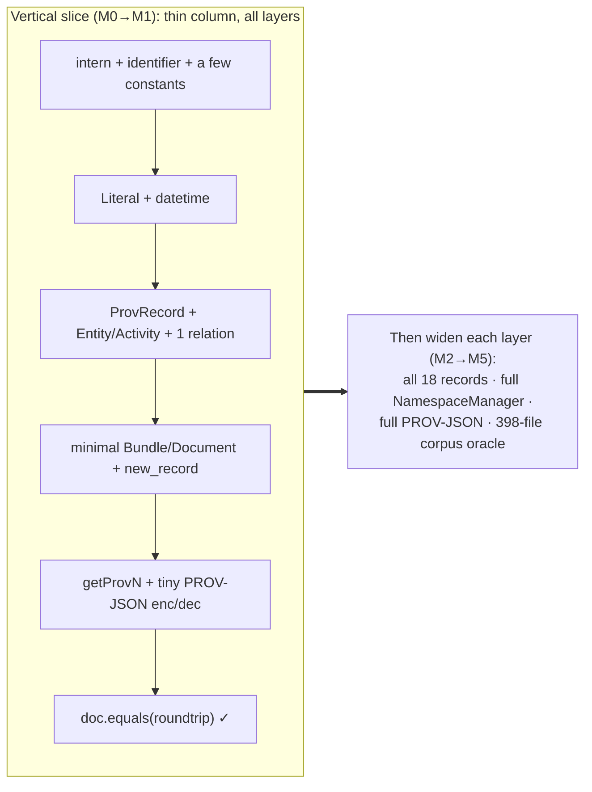
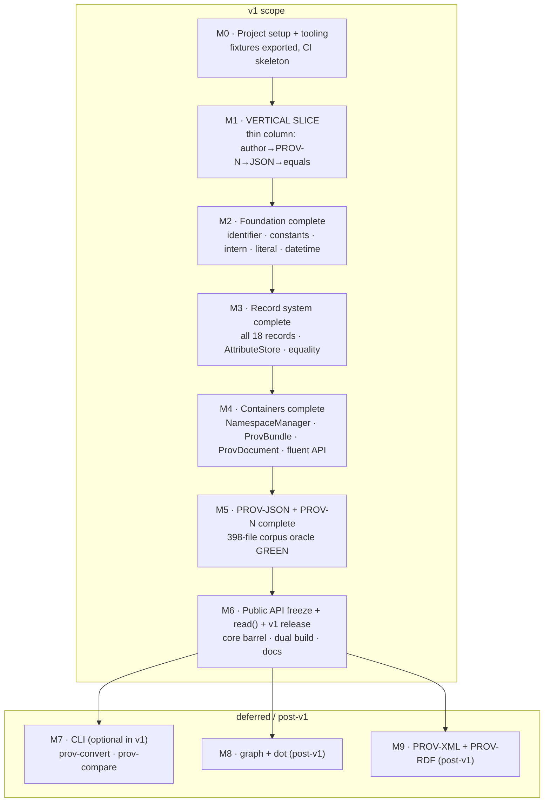
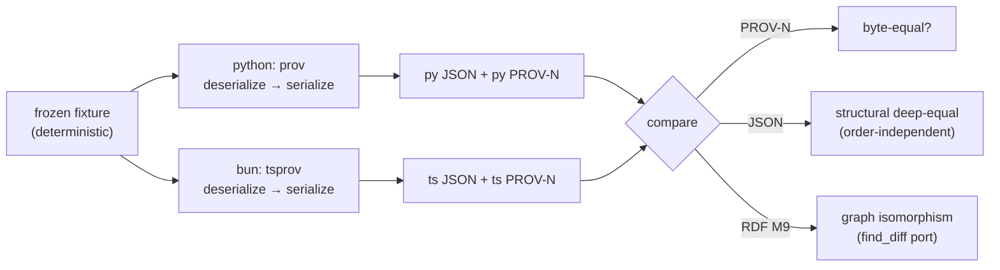

# 02 — Migration Roadmap

> The **execution plan** for porting the Python [`prov`](https://github.com/trungdong/prov) library (v2.1.1, W3C PROV Data Model) to TypeScript as `tsprov`. This document sequences the work into milestones, defines the validation gates, and fences the scope.
>
> Read first / read alongside:
> - [01-codebase-analysis.md](01-codebase-analysis.md) — what the Python code does, module by module (the source map).
> - [03-dependency-analysis.md](03-dependency-analysis.md) — third-party replacements (luxon, N3, @xmldom/xmldom, ts-graphviz) and the optional-deps strategy.
> - [04-typescript-feasibility.md](04-typescript-feasibility.md) — the idiomatic TS design (value-equality via canonical keys + intern, class hierarchy, authoring API).
>
> Source root: `reference/prov/src/prov`. Target repo: `/Users/s-ved/repos/inflexa/tsprov` (currently a greeting scaffold: `src/index.ts`, `src/greeting.ts`; Bun + strict TS; dual ESM+CJS already wired in `package.json`/`tsconfig.json`). Golden corpora are already vendored under `reference/prov/src/prov/tests/{json,rdf,xml,unification}/` (398 / 402 / 45 / 9 files). All `file.py:NN` anchors point into the source root.

---

## 1. Guiding principles & definition of done

Five principles, in priority order. When two conflict, the earlier wins.

| # | Principle | What it means concretely | Where enforced |
|---|---|---|---|
| **P1** | **Semantics-preserving** | The TS port reproduces PROV-DM behavior exactly: value-based equality/hashing of `QualifiedName`/`Literal`/`ProvRecord`, formal-vs-extra attribute split, `FORMAL_ATTRIBUTES` ordering, single-valued-formal enforcement, the asymmetric blank-id equality rule (`model.py:533`), and byte-equivalent serialization. Behavioral deviations are allowed **only** when explicitly documented and harmless (e.g. dropping `defaultdict` read-mutation, [04 §5](04-typescript-feasibility.md)). | Golden-corpus differential tests (§5) |
| **P2** | **Golden round-trip parity with Python** | For every fixture in `tests/json/` (and later `rdf/`, `xml/`), TS `deserialize → serialize → deserialize` produces a document that `.equals()` the parsed original; and TS output is structurally identical to Python's output for deterministic fixtures. The Python suite *is* the spec ([04 §10](04-typescript-feasibility.md)). | CI differential harness (§5.5) |
| **P3** | **Idiomatic TypeScript** | No line-by-line transliteration. Value-equality → canonical `key` getters + intern table; `__getitem__`/operator overloads → methods; `defaultdict` → `getOrInit`; `**kwargs` → option objects/overloads; classes (not discriminated unions) for the record hierarchy. Strict-mode clean, no `any` at boundaries ([04 §3–§6](04-typescript-feasibility.md)). | tsconfig strict + no-`any` budget (§4) |
| **P4** | **Dependency-free core** | The core (`model` + PROV-JSON + PROV-N) installs with only **luxon**. XML/RDF/graph/dot are behind subpath exports + optional peers, dynamically gated ([03 §4](03-dependency-analysis.md)). The common case (authoring + JSON/PROV-N round-trip) is browser-safe and tree-shakeable. | `package.json` exports/peers (§4) |
| **P5** | **Incremental & releasable** | Each milestone is independently mergeable, compiles green, and freezes a public-API surface. v1 ships core + JSON + PROV-N; spec-completeness formats and viz are post-v1 (§8). | Per-milestone exit gate (§3) |

### Definition of done (per the whole project)

`tsprov` is **done for v1** when:

1. `ProvDocument`/`ProvBundle` expose the full fluent authoring API (3 elements + 18 relation builders + camelCase aliases) with type-safe refs ([04 §4](04-typescript-feasibility.md)).
2. PROV-JSON serialize **and** deserialize, plus PROV-N serialize, are correct against the 398-file `json/` corpus (P2).
3. `doc.equals(other)` and the `key`/`valueKey` machinery match Python value-equality on the corpus (P1, the central risk — [04 §6](04-typescript-feasibility.md)).
4. The package builds dual ESM+CJS with `.d.ts`, core deps = `{luxon}`, `sideEffects:false`, strict tsconfig clean.
5. `read()` format auto-detect works for JSON/PROV-N; `prov-convert`/`prov-compare` CLIs (optional in v1, see §8) preserve the 0/1/2 exit-code contract.

XML, RDF, graph, dot are **out of scope for v1** (§8) and explicitly deferred behind optional subpath modules.

---

## 2. Migration strategy

### 2.1 Bottom-up by the dependency DAG, with an early vertical slice

Two forces shape the order:

- **Bottom-up (leaves first).** The internal dependency order is `identifier → constants → {literal, datetime} → record → namespace-manager → bundle/document → serializers → {graph, dot, cli}` ([01 §2.1](01-codebase-analysis.md), [03 §1](03-dependency-analysis.md)). You cannot test a record without QNames; you cannot test a bundle without records; you cannot serialize without a document. So foundational value types come first.
- **De-risk the API early with a vertical slice.** The single biggest risk is **value-equality/hashing under reference-keyed `Map`/`Set`** ([04 §6](04-typescript-feasibility.md)). The fastest way to prove the chosen strategy (canonical `key` + intern + `equals()`) is to build a *thin column* through every layer — enough model to author one tiny document, render it to PROV-N, round-trip it through PROV-JSON, and assert `doc.equals(back)` — before fleshing out all 18 record classes and the full serializer surface.

So the plan is **bottom-up in breadth, but front-loaded with a narrow end-to-end column** (M0–M1). The vertical slice lands the equality machinery and the serializer contract against *real* behavior immediately, then later milestones widen each layer to full coverage.



### 2.2 Why this order (vs alternatives)

- **Not top-down** (start at `serialize()`): impossible — nothing to serialize without the model.
- **Not "full layer at a time, no slice"**: would defer the equality proof until after building all records + the full NamespaceManager, i.e. the riskiest assumption is validated last. The slice inverts that.
- **Not "JSON before PROV-N"**: PROV-N is `document.getProvN()` only (`provn.py:24`, no peer, ~trivial) and forces the `getProvN`/`encoding_provn_value` formatting work that the model needs anyway. Build PROV-N rendering as part of the model, then PROV-JSON as the first *deserializing* format.

### 2.3 The build order (canonical, from [04 §12](04-typescript-feasibility.md))

`intern`/`identifier`/`constants` → `literal`/`datetime` → `record` (+ `AttributeStore`, equality) → `namespace-manager` → `bundle`/`document` → `serializers/json` + `provn` → golden-corpus differential tests → **then optional & gated:** `xml`, `rdf`, `graph`, `dot`, `cli`.

---

## 3. Phased plan — milestones M0…M9

Each milestone lists **scope** (target modules from the canonical layout), **entry/exit criteria**, the **validation gate**, **effort** (rough, ideal-engineer-days), and the **source files replaced**. Module names match [04 §2](04-typescript-feasibility.md) exactly.

### Milestone dependency flowchart



> M1 (the slice) intentionally **overlaps** M2–M5: it builds a *minimal* version of each layer. M2–M5 then *complete* those layers. This is deliberate — the slice is throwaway-resistant scaffolding that the wider milestones grow into, not a parallel track.

---

### M0 — Project setup, fixtures, CI skeleton

| | |
|---|---|
| **Scope** | Tooling only. No `src/` model code yet. Add `biome`/`prettier`, wire `bun test`, set up the **fixture export script** (§5.1), vendor/symlink the golden corpora, scaffold the differential CI job (§5.5), expand the canonical `src/` directory skeleton (empty files per [04 §2](04-typescript-feasibility.md)). Replace the greeting scaffold (`src/greeting.ts`, `src/greeting.test.ts`). |
| **Entry** | Current repo: greeting scaffold, single-export `package.json`, strict `tsconfig.json`. |
| **Exit** | `bun test` runs (even with zero real tests); a Python venv with `prov` installed from `reference/prov/src` exports the example corpus to `fixtures/`; CI runs lint + typecheck + test on push. |
| **Gate** | CI green on an empty/trivial test; fixture export script produces N JSON + N PROV-N files deterministically (clock frozen, §5.2). |
| **Effort** | 1–2 d |
| **Source replaced** | `pyproject.toml`, `tox.ini`, `Makefile`, `.coveragerc`, `setup.cfg` → `package.json` scripts + biome config + CI matrix ([03 §6](03-dependency-analysis.md), scripts-packaging analysis). |

### M1 — Vertical slice (de-risk the core API)

| | |
|---|---|
| **Scope** | A *minimal* column through every layer: `src/intern.ts`, `src/identifier.ts` (Identifier/QualifiedName/Namespace), a handful of constants in `src/constants.ts` (PROV/XSD namespaces, `PROV_ENTITY`/`PROV_ACTIVITY`/`PROV_GENERATION` + a few `PROV_ATTR_*`), `src/literal.ts`, `src/datetime.ts` (luxon facade), `src/record/{record,element,relation,registry,attributes}.ts` (only `ProvEntity`, `ProvActivity`, `ProvGeneration`), a stub `src/namespace-manager.ts`, minimal `src/bundle.ts` + `src/document.ts` with `new_record`/`entity`/`activity`/`generation`/`getProvN`, and a *tiny* `src/serializers/{provn,json}.ts` covering only those three record types. |
| **Entry** | M0 complete. |
| **Exit** | This program runs and asserts true: build a doc (`ex:report` entity, `ex:write` activity, `wasGeneratedBy`), `getProvN()` returns the expected text, `serialize('json')`/`deserialize` round-trips, and `doc.equals(back) === true`. The equality machinery (`key`, `valueKey`, intern) is real, not stubbed. |
| **Gate** | The Day-1 acceptance test (§9) passes. `primer`-style equality holds for the thin doc. **This is the proof that the canonical-key equality strategy works** ([04 §6](04-typescript-feasibility.md)). |
| **Effort** | 3–4 d |
| **Source replaced** | Thin slices of `identifier.py`, `constants.py`, `model.py` (Literal, ProvRecord, ProvEntity/Activity/Generation, ProvBundle/Document core, new_record, get_provn), `provn.py`, `provjson.py`. |

### M2 — Foundation complete

| | |
|---|---|
| **Scope** | Finish `src/identifier.ts`, `src/intern.ts`, **all** of `src/constants.ts` (every PROV/XSD/XSI namespace, all type QNames, all `PROV_ATTR_*`, and every wiring map: `PROV_N_MAP`, `ADDITIONAL_N_MAP`, `PROV_BASE_CLS`, `PROV_ATTRIBUTE_QNAMES`/`_LITERALS`/`PROV_ATTRIBUTES`, the inverse maps), `src/literal.ts` (full XSD datatype handling + tri-state boolean), `src/datetime.ts`, `src/error.ts` (`ProvError`/`ProvException` hierarchy). |
| **Entry** | M1 slice green. |
| **Exit** | All constants minted and interned; `PROV_ENTITY === PROV.qn('Entity')`; every map is `Map<string,…>`/`Set<string>` keyed by `qn.uri`; Literal round-trips every XSD type from the attribute matrix; datetime facade preserves offset + sub-second. |
| **Gate** | Unit tests: identity/equality conformance (Namespace identity includes prefix; QName identity ignores prefix — the two-prefix-same-URI case from `tests/attributes.py:4-5`); Literal `.key`/`.equals` over the 28-value `attribute_values` matrix; `parseXsdDateTime`/`toXsdDateTime` ISO parity. |
| **Effort** | 3–4 d |
| **Source replaced** | `identifier.py` (191), `constants.py` (216), the helpers + Literal + exceptions of `model.py` (lines 1–268: `parse_xsd_datetime`, `parse_boolean`, `parse_xsd_types`, `first`, `encoding_provn_value`, `Literal`, exception hierarchy), `__init__.py` Error base. |

### M3 — Record system complete

| | |
|---|---|
| **Scope** | `src/record/record.ts` (full `ProvRecord`: `AttributeStore`-backed attributes, `add_attributes` with single-valued-formal enforcement + `is_collection`, `_auto_literal_conversion`, `attributes`/`formal_attributes`/`extra_attributes`, `getProvN`, `equals`, `key`, `copy`), `src/record/element.ts` (Entity/Activity/Agent + fluent methods + `set_time`), `src/record/relation.ts` (**all 14** relations + `ProvMention ⊂ ProvSpecialization`), `src/record/attributes.ts` (the `AttributeStore`), `src/record/registry.ts` (`PROV_REC_CLS` as `Map<string, RecordCtor>` + `registerRecordClass`). |
| **Entry** | M2 complete. |
| **Exit** | Every record class declares its `static FORMAL_ATTRIBUTES` + `static prov_type`; the registry maps all 18 type QNames to constructors; `copy()` dispatches through it; `getProvN()` renders elements/relations with correct `-` placeholders, `id; ` prefixes, formal order, extra `[...]` blocks. |
| **Gate** | Per-record `getProvN` unit tests; `add_attributes` single-valued rule tests (second-equal ignored, second-different throws, non-comparable throws — `model.py:505-524`); `test_extra_attributes` contract `len(attributes) === len(formal) + len(extra)` (`test_extras.py:128`); `attributeKeySet` dedup of exact-duplicate pairs (the double-`add_types` fixture). **Note the non-comparable branch (`model.py:514-516`):** when comparing a new value against the existing one for a single-valued formal attribute, Python catches the `TypeError` and treats a non-comparable second value as DIFFERENT, which is precisely why it surfaces as the "more than one value" error. The TS port must replicate this try/except-equivalent semantics, not merely "throw on non-comparable". |
| **Effort** | 5–7 d |
| **Source replaced** | `model.py` records layer (lines ~269–1125: `ProvRecord`, `ProvElement`, `ProvRelation`, all concrete classes, `PROV_REC_CLS`, `DEFAULT_NAMESPACES`). |

### M4 — Containers + fluent authoring API complete

| | |
|---|---|
| **Scope** | `src/namespace-manager.ts` (full `NamespaceManager` as composition over `Map<string,Namespace>` + 4 side-maps; `valid_qualified_name` precedence resolver; `add_namespace` returning the effective namespace; `get_anonymous_identifier`) — note that in Python `NamespaceManager` *extends* `dict` (`model.py:1127` `class NamespaceManager(dict)`): the base class IS the prefix→namespace dict, partially redundant with the `_namespaces` side-map, so the TS composition must fold both roles into one map, `src/bundle.ts` (full `ProvBundle`: `_records`/`_id_map`, `get_records`/`get_record`, **all 18 fluent builders + camelCase aliases**, subtype methods `revision`/`quotation`/`primary_source`/`collection` via `addAssertedType`, `__eq__`→`equals`, `_unified_records`/`unified`/`update`, `get_provn` for the container, `sorted_attributes`), `src/document.ts` (full `ProvDocument`: `_bundles`, `bundle`/`add_bundle`, `flattened`, `unified`, `update`, `serialize`/`deserialize` dispatch). |
| **Entry** | M3 complete. |
| **Exit** | The complete authoring API compiles with type-safe refs ([04 §4](04-typescript-feasibility.md)); `primer_example` and `primer_example_alternate` build `.equals()`-equal docs; bundle equality is content-keyed (§[04 §6](04-typescript-feasibility.md)); flatten/unify/update preserve the documented copy-vs-mutate quirks (`flattened` may return `this`; `unified` shares the NS manager). The gates that rely on `doc.equals()` must port the container-level equality methods that differ from `ProvRecord.__eq__` (`model.py:528`): `ProvBundle.__eq__` (`model.py:1619`, set-equality of records) and `ProvDocument.__eq__` (`model.py:2523`, bundle-set equality on top of the bundle comparison). |
| **Gate** | `primer == primer_alternate` (`test_extras.py`); flatten/unify count tests (`TestFlattening`, `TestUnification` over `tests/unification/`); bundle name-clash/no-id/add-garbage `ProvException` tests; namespace inheritance + default-namespace + flattening tests (`tests/qnames.py`). |
| **Effort** | 6–8 d |
| **Source replaced** | `model.py` container layer (lines 1127–2838: `NamespaceManager`, `ProvBundle` + fluent API, `ProvDocument`, `sorted_attributes`). |

### M5 — PROV-JSON + PROV-N complete (corpus oracle green)

| | |
|---|---|
| **Scope** | `src/serializers/serializer.ts` (the `Serializer` interface + `Registry`/`getSerializer`/`registerSerializer` + `DoNotExist` for unknown-format lookup — `serializers/__init__.py:49`; optionally an `UnsupportedOperationError` **(new, TS-only)** for unimplemented operations, since Python's PROV-N `deserialize` just raises the built-in `NotImplementedError` — `provn.py:31-32`), `src/serializers/provn.ts` (delegates to `getProvN`; deserialize throws `NotImplementedError`-equivalent), `src/serializers/json.ts` (full `encode/decodeJsonDocument`+`Container`+`Representation`, `AnonymousIDGenerator`, `literalJsonRepresentation`, the **singleton-or-list collapse** at `provjson.py:177-189` and the **membership HACK** around `provjson.py:231-298` — the extra-members set is built ~231-254 and the extra relations created ~287-291). |
| **Entry** | M4 complete. |
| **Exit** | The full 398-file `json/` corpus passes the timestamp-safe differential test (parse golden → re-serialize → `deserialize` → `.equals()`); PROV-N output matches Python's `get_provn` on deterministic fixtures byte-for-byte (incl. `%g`/`%i`/`%%`/multiline quoting). |
| **Gate** | **The primary oracle:** `tests/json/` (398) round-trip green; PROV-N differential (§5) green on deterministic fixtures; unicode-survival decode test (`test_json.py:12`). |
| **Effort** | 5–7 d |
| **Source replaced** | `serializers/__init__.py` (87), `serializers/provn.py` (32), `serializers/provjson.py` (340). |

### M6 — Public API freeze + `read()` + v1 release

| | |
|---|---|
| **Scope** | `src/index.ts` (the public barrel — core only, [04 §11](04-typescript-feasibility.md)), `src/read.ts` (`read(source, format?)` with async I/O edge + sync format probe), dual build verification (`bun build` ESM+CJS + `tsc` types), typedoc, README, CHANGELOG, `npm version` flow. Freeze the v1 public surface. |
| **Entry** | M5 green. |
| **Exit** | `import { ProvDocument } from 'tsprov'` works in ESM and CJS; `read()` auto-detects JSON/PROV-N; package publishes with `dependencies: {luxon}` only; API-freeze snapshot recorded (§4). |
| **Gate** | Build artifacts typecheck under a *consumer* tsconfig (both `module:nodenext` and `bundler`); a smoke import test in a throwaway ESM and CJS project; public-API snapshot diff is empty vs the frozen surface. |
| **Effort** | 2–3 d |
| **Source replaced** | `__init__.py` `read()` (defined at `__init__.py:23`, ~30 lines; the file is 58 lines total), packaging glue. |

### M7 — CLI (optional in v1)

| | |
|---|---|
| **Scope** | `src/cli/convert.ts`, `src/cli/compare.ts` via `util.parseArgs`; `bin` entries; preserve exit codes (convert 0/2; compare 0 equal / 1 differ / 2 error). Graphviz render path deferred to M8. |
| **Entry** | M6 (JSON/PROV-N serialize/deserialize available). |
| **Exit** | `prov-convert -f provn in.json` and `prov-compare a.json b.json` work over JSON/PROV-N; binary/text output split honored. |
| **Gate** | CLI integration tests on exit codes + format round-trips; `CliError` 'E: ' message + exit-2 mapping. |
| **Effort** | 2 d |
| **Source replaced** | `scripts/convert.py` (204), `scripts/compare.py` (151). |

### M8 — graph + dot (post-v1, optional/gated)

| | |
|---|---|
| **Scope** | `src/graph.ts` (`prov_to_graph`/`graph_to_prov`, `INFERRED_ELEMENT_CLASS`) via a hand-rolled MultiDiGraph keyed by `identifier.uri` (or `graphology`); `src/dot.ts` (`prov_to_dot`, style maps) via `ts-graphviz` emitting DOT text; rasterization behind `@hpcc-js/wasm` (SVG) / `@ts-graphviz/adapter` (PNG/PDF). Both under subpath exports `tsprov/graph`, `tsprov/dot`. |
| **Entry** | M6. |
| **Exit** | `prov_to_graph→graph_to_prov` round-trips the non-bundle example docs (`test_graphs.py`); `prov_to_dot` emits valid DOT; SVG render works in-process. |
| **Gate** | Graph round-trip equality; DOT smoke (SVG size > threshold, `test_dot.py`). Preserve the `bundle == null` inferred-node sentinel. |
| **Effort** | 3–4 d |
| **Source replaced** | `graph.py` (113), `dot.py` (409). |

### M9 — PROV-XML + PROV-RDF (post-v1, optional/gated)

| | |
|---|---|
| **Scope** | `src/serializers/xml.ts` via `@xmldom/xmldom` (subpath `tsprov/xml`); `src/serializers/rdf.ts` via `n3` + RDF/JS DataFactory (subpath `tsprov/rdf`). Both self-register on import; both dynamically gate their peer with a clear "install X" error. |
| **Entry** | M6 (model + JSON corpus solid as the cross-format input source). |
| **Exit** | XML validates against curated `example_06/07/08.xml` via c14n diff (round-trip is **one-way/known-lossy** — `test_xml.py:406`); RDF passes the `json→ttl` differential via graph isomorphism over the `rdf/` corpus, with the declared lossy set excluded. |
| **Gate** | XML c14n golden diff; RDF graph-isomorphism (`find_diff` port) over `rdf/` (402); reproduce Python's `@expectedFailure`/skip sets as named exclusions ([03 §5](03-dependency-analysis.md)). |
| **Effort** | XML 5–7 d · RDF 8–12 d (the hardest port after the model) |
| **Source replaced** | `serializers/provxml.py` (433), `serializers/provrdf.py` (759). |

---

## 4. Guardrails

Process and tooling rules that keep the port honest. These apply across all milestones.

| Guardrail | Rule | Rationale / source |
|---|---|---|
| **Strict tsconfig** | Keep the existing `strict`, `noUncheckedIndexedAccess`, `verbatimModuleSyntax`, `noImplicitOverride`, `noFallthroughCasesInSwitch`. Do **not** loosen to land a milestone. | Already set; `noUncheckedIndexedAccess` directly catches the `Map.get → undefined` cases that the Python `defaultdict` masked ([04 §5](04-typescript-feasibility.md)). |
| **No-`any` budget** | Zero `any` at public boundaries. Internal `any` allowed only with `// ANY-BUDGET: <reason>` and tracked in a counter that must trend to 0 by M6. `unknown` + narrowing at every deserialize entry point. | [04 §1](04-typescript-feasibility.md) "strict-mode clean". |
| **Golden fixtures from Python** | All correctness fixtures are **generated from the Python lib** (`reference/prov/src/prov`), never hand-authored. The `json/`/`rdf/`/`xml/`/`unification/` corpora are vendored verbatim and frozen. | §5.1; P2. |
| **PROV-N as text oracle** | Treat `get_provn()` output as a canonical, human-readable text oracle: any model change that alters PROV-N for a deterministic fixture must be a *reviewed* diff against the Python-generated golden. | §5.3; PROV-N is exact (`%g`/`%i`/`%%`/triple-quote). |
| **Differential tests in CI** | A CI job runs the **same inputs through Python `prov` and TS `tsprov`** and asserts structural/PROV-N parity for deterministic fixtures (§5.5). Non-deterministic (`now()`) fixtures use the in-memory self-compare pattern. | §5.5; P2. |
| **Public-API freeze per milestone** | From M1 onward, each milestone snapshots its exported surface (e.g. via `tsc --emitDeclarationOnly` + an API-extractor diff). Breaking the frozen surface requires an explicit changeset entry. | P5. |
| **Optional deps deferred behind extras** | luxon is the only `dependency`. `n3`/`@xmldom/xmldom`/`ts-graphviz`/`@hpcc-js/wasm`/`graphology` are `peerDependencies` + `peerDependenciesMeta.optional`, reachable only via subpath exports + dynamic `import()`. The core barrel must never statically import them. | [03 §4](03-dependency-analysis.md), [04 §2](04-typescript-feasibility.md). |
| **Scope-creep fences** | **XML, RDF, graph, dot, and Graphviz rasterization are explicitly deferred to M8/M9 (post-v1).** No work on them may block or precede M5. A PR touching `src/serializers/{xml,rdf}.ts` or `src/{graph,dot}.ts` before M6 is rejected. | §8. |
| **Commit / PR hygiene** | Conventional commits (`feat:`/`fix:`/`test:`/`chore:`). PRs scoped to one milestone-slice, ideally < ~600 changed LOC (excluding vendored fixtures). Every PR green on lint + typecheck + the relevant gate before merge. | P5. |
| **Behavioral-deviation log** | Any intentional divergence from Python (e.g. dropping `defaultdict` read-mutation; `Set` insertion-order making `first()` deterministic; serializers returning `string` not writing streams) is recorded in a `DEVIATIONS.md` with the source anchor and the reason. | [04 §5, §7.1](04-typescript-feasibility.md). |

---

## 5. Validation strategy

The Python suite is the specification, and value-based equality is the entire oracle ([04 §10](04-typescript-feasibility.md), tests analysis). The strategy has five concrete pieces.

### 5.1 Export the Python corpus to JSON + PROV-N fixtures

The `tests/json/`, `tests/rdf/`, `tests/xml/`, `tests/unification/` corpora are **already vendored** under `reference/prov/src/prov/tests/` (398 / 402 / 45 / 9 files) and mirror the test methods 1:1. Copy them verbatim into the TS repo as a frozen oracle.

In addition, write a small Python export script (run against `prov` installed from `reference/prov/src`) that materializes the **hand-built example/statement documents** from `tests/examples.py` and `tests/statements.py` to disk in both PROV-JSON and PROV-N, with a **frozen clock**:

```python
# scripts/export_fixtures.py (run with the reference prov on PYTHONPATH)
from prov.tests.examples import tests as EXAMPLES   # the 8 (name, builder) pairs
for name, build in EXAMPLES:
    doc = build()
    Path(f"fixtures/{name}.json").write_text(doc.serialize(format="json", indent=4))
    Path(f"fixtures/{name}.provn").write_text(doc.get_provn())
```

These become the `fixtures/` directory the TS port must reproduce. (`statements.py`/`attributes.py` fixtures that use `datetime.now()` are handled by §5.2.)

### 5.2 Deterministic vs non-deterministic fixtures

`statements.py`/`attributes.py` bake `datetime.now()` into many docs (tests analysis), so those goldens cannot be regenerated-and-compared. Two rules:

- **Deterministic fixtures** (`examples.datatypes` fixed instant, relation tests without time, the whole `json/` corpus which captured frozen instants): TS must reproduce byte/structure-equivalently — these drive the differential tests.
- **Non-deterministic (`now()`) fixtures**: use the **in-memory self-compare** pattern (build doc → serialize → deserialize → `.equals()`), exactly as the Python `RoundTrip*Tests` do — never compare a `now()`-doc to a checked-in golden. If a golden is needed, **freeze the clock** in the export script.

### 5.3 PROV-N as the canonical text oracle

PROV-N is exact and human-readable, so it's the best diff target for model bugs. For every deterministic fixture, assert TS `getProvN()` equals the Python-exported `.provn` byte-for-byte. This pins down: `%g` float formatting, `%i` bool, ` %% datatype` suffixes, `-` placeholders, `id; ` relation prefix, triple-quoted multiline strings, single-quote QName forms (`model.py:132`, `model.py:541`, `identifier.py:102`). Budget a focused `%g` unit test against the `datatypes`/`long_literals`/`TestLiteralRepresentation` strings ([04 §7.4](04-typescript-feasibility.md)).

### 5.4 Property-based + conformance tests

- **Round-trip property** (e.g. via `fast-check`): for a generated `ProvDocument`, `deserialize(serialize(doc, 'json'), 'json').equals(doc)` holds. Generators emit valid QNames, the full literal matrix, duplicate-attribute cases, and blank-id relations.
- **Equality/hashing conformance** (the central risk, [04 §6](04-typescript-feasibility.md)): dedicated tests that `QualifiedName.key === uri` (prefix-independent), `Namespace.key` includes prefix, `Literal.key` over `(value, datatype, langtag)`, `ProvRecord.key` is order-independent and dedups exact-duplicate pairs, and the asymmetric blank-id record rule (`model.py:533`).
- **Coverage targets**: ≥ 90% line + branch on the core (`identifier`, `constants`, `literal`, `datetime`, `record/*`, `namespace-manager`, `bundle`, `document`, `serializers/{json,provn}`) by M6, measured with `bun test --coverage`. Optional modules (M8/M9) target ≥ 80%.

### 5.5 The Python ↔ TS differential harness

A CI job that proves parity, not just internal consistency:



- **PROV-N**: byte-exact comparison (deterministic fixtures only).
- **JSON**: structural deep-equal (key order and multi-valued attribute order normalized, since PROV equality is order-independent — tests analysis).
- **RDF (M9 only)**: graph isomorphism via a port of `find_diff` (`test_rdf.py:24`) using `n3` to parse both sides; never string equality. Reproduce the positional skip lists as **filename-keyed** exclusions (convert the `sorted(glob(...))` indices to names once, [03 §5](03-dependency-analysis.md)).

The harness gates merges from M5 onward (JSON+PROV-N) and from M9 (RDF/XML).

---

## 6. Risk register

| Risk | Likelihood | Impact | Mitigation |
|---|---|---|---|
| **Value-equality/hashing fidelity** — `valueKey`/`record.key`/`equals` diverge from Python hash/eq (number formatting, langtag, the asymmetric blank-id rule at `model.py:533`), silently breaking the *entire* corpus oracle. | High | Critical | **Land the equality machinery first** (M1 slice), test against `tests/json/` (398) and the equality-conformance suite (§5.4) **before** building the full serializer surface. Canonical `key` getters + global intern + explicit `equals()` ([04 §6](04-typescript-feasibility.md)). |
| **int vs double round-trips** — JS `number` cannot distinguish `1` from `1.0`; JSON/RDF encoders key on Python `float`/`int` type (`provjson.py:52`, `provrdf.py:75`). | High | High | Carry the XSD datatype **on the value**: typed scalars as `Literal{value, datatype}`; bare `number` defaults to `xsd:double` (matches `float`); ints require explicit `new Literal(5, XSD_INT)`. Verify against the 28-value `attribute_values` matrix ([04 §3.2](04-typescript-feasibility.md)). |
| **Datetime offset/precision fidelity** — byte-equivalent serialization needs the source UTC offset + sub-second digits intact across JSON/XML/RDF. | Medium | High | luxon `DateTime.fromISO(s, {setZone:true})` (preserves offset) + `.toISO()`; centralized `datetime.ts` facade; `parseXsdDateTime`→`null` on failure; unit-test `isoformat` parity. **Never bare `Date`** ([03 §2.3](03-dependency-analysis.md)). |
| **Namespace validation edge cases** — `valid_qualified_name` deep branching with `existing_ns is namespace` object-identity vs equality, default-ns `dn` synthesis, URI compaction, parent delegation; `add_namespace` returns a *substituted* namespace (`model.py:1203-1348`). | Medium | High | Port the precedence ladder exactly with explicit ordering; preserve reference-identity vs structural-equality distinction; **callers must use `add_namespace`'s return value**. Drive with `tests/qnames.py` (inheritance + flattening) and the two-prefix-same-URI fixtures. |
| **Serializer determinism / attribute ordering** — PROV attributes stored as sets; `first()`/`encode_json_container` pull from set iteration order; multi-valued attr output order is unstable in Python (`provjson.py:163`, `model.py:117`). | Medium | Medium | Back attribute storage with an **insertion-ordered, deduped** collection (`AttributeStore`) so TS output is deterministic; normalize multi-valued attribute order in JSON comparison (equality is order-independent anyway). Flag the "TS is more deterministic than Python" deviation. |
| **RDF/XML scope blowout** — the optional serializers (1,192 LOC combined) are the hardest port; risk of consuming v1 time. | Medium | Medium | **Hard scope fence (§4):** XML/RDF are M9, post-v1. No work precedes M5. Drive entirely by the golden corpora + isomorphism comparison; import Python's known-lossy exclusion sets verbatim, not as bugs ([03 §5](03-dependency-analysis.md)). |
| **PROV-N `%g`/escaping exactness** — no native `printf`; exact emitted text is asserted. | Medium | Medium | A vetted `%g`/`formatFloatG` helper, unit-tested against `datatypes`/`long_literals`/`TestLiteralRepresentation` golden PROV-N strings ([04 §7.4](04-typescript-feasibility.md)). |
| **`defaultdict` read-mutation behavior change** — Python inserts empty keys on read (`label`, `get_asserted_types`, `get_provn`); TS `Map.get` does not. | Low | Low | **Intentional, documented deviation**: do not reproduce phantom empty keys; audit readers to tolerate missing keys; record in `DEVIATIONS.md` ([04 §5](04-typescript-feasibility.md)). |
| **Copy-vs-mutate quirks** — `flattened()` returns `self` when no bundles; `unified()` shares the NamespaceManager by reference; `add_bundle` mutates its argument (`model.py:2582,2602,2637`). | Low | Medium | Preserve quirks deliberately and document; if deviating (always-copy), flag as a behavior change since serializer round-trips depend on current behavior. |

---

## 7. Milestone summary table

| Milestone | Target modules ([04 §2](04-typescript-feasibility.md)) | Source replaced | Gate | Rough effort | Deferred-until |
|---|---|---|---|---|---|
| **M0** Setup | tooling, `fixtures/`, CI, dir skeleton | `pyproject.toml`/`tox.ini`/`Makefile`/`setup.cfg`/`.coveragerc` | CI green on trivial test; fixture export deterministic | 1–2 d | — |
| **M1** Vertical slice | `intern`, `identifier`, partial `constants`, `literal`, `datetime`, `record/*` (Entity/Activity/Generation), minimal `bundle`/`document`, tiny `serializers/{provn,json}` | thin slices of `identifier.py`, `constants.py`, `model.py`, `provn.py`, `provjson.py` | Day-1 acceptance test (§9): author → PROV-N → JSON round-trip → `equals` | 3–4 d | — |
| **M2** Foundation | `identifier`, `intern`, **all** `constants`, `literal`, `datetime`, `error` | `identifier.py`, `constants.py`, `model.py:1-268`, `__init__.py` Error | identity/equality + Literal matrix + datetime ISO conformance | 3–4 d | — |
| **M3** Records | `record/{record,element,relation,attributes,registry}` | `model.py:269-1125` | per-record `getProvN`; single-valued rule; formal/extra split; dedup | 5–7 d | — |
| **M4** Containers | `namespace-manager`, `bundle`, `document` | `model.py:1127-2838` | `primer == primer_alternate`; flatten/unify; qname inheritance; bundle exceptions | 6–8 d | — |
| **M5** JSON + PROV-N | `serializers/{serializer,provn,json}` | `serializers/__init__.py`, `provn.py`, `provjson.py` | **398-file `json/` corpus round-trip + PROV-N differential GREEN** | 5–7 d | — |
| **M6** API freeze + release | `index`, `read` | `__init__.py` `read()`, packaging | dual ESM+CJS smoke import; API snapshot frozen; deps={luxon} | 2–3 d | — |
| **M7** CLI | `cli/{convert,compare}` | `scripts/convert.py`, `scripts/compare.py` | exit-code contract (0/1/2); format round-trips | 2 d | v1 (optional) or post-v1 |
| **M8** graph + dot | `graph`, `dot` | `graph.py`, `dot.py` | graph round-trip; DOT smoke | 3–4 d | post-v1 |
| **M9** XML + RDF | `serializers/{xml,rdf}` | `provxml.py`, `provrdf.py` | XML c14n golden diff; RDF graph isomorphism over `rdf/` | XML 5–7 d · RDF 8–12 d | post-v1 |

**Total to v1 (M0–M6):** ~25–35 ideal-engineer-days. Post-v1 (M7–M9): ~20–28 d (RDF dominates).

---

## 8. Out-of-scope / deferred decisions

### Ships in v1 (M0–M6, optionally M7)

- The full PROV-DM in-memory model: `Identifier`/`QualifiedName`/`Namespace`/`Literal`, all 18 concrete record classes (3 elements + 15 relation classes), `NamespaceManager`, `ProvBundle`, `ProvDocument`.
- The complete **fluent authoring API** (camelCase PROV vocabulary primary + descriptive aliases) with type-safe refs.
- **PROV-JSON** (serialize + deserialize) and **PROV-N** (serialize only).
- `read()` format auto-detect (JSON/PROV-N), `equals()`/unify/flatten/update.
- Dual ESM+CJS publish, `dependencies: {luxon}`, browser-safe, tree-shakeable.
- *(Optional in v1)* `prov-convert`/`prov-compare` CLIs over JSON/PROV-N (M7) — promote to post-v1 if M6 timeline is tight.

### Deferred to post-v1 (M8, M9)

| Deferred | Milestone | Why deferred | Behind |
|---|---|---|---|
| **PROV-XML** (serialize/deserialize) | M9 | `@xmldom/xmldom` port with per-node nsmap + pretty-print; round-trip is **one-way/known-lossy** (`test_xml.py:406`). | subpath `tsprov/xml` + optional peer |
| **PROV-RDF / PROV-O** | M9 | Hardest port (759 LOC of prov-specific predicate remapping, driven through `encode_container` — `provrdf.py:261`); needs `n3` + RDF/JS assembly. | subpath `tsprov/rdf` + optional peer |
| **graph** (prov ↔ MultiDiGraph) | M8 | Leaf adapter; hand-roll or `graphology`. | subpath `tsprov/graph` |
| **dot** (prov → DOT) | M8 | Leaf adapter; `ts-graphviz` build. | subpath `tsprov/dot` |
| **Graphviz rasterization** (PNG/PDF/SVG) | M8 | No pure-JS PNG/PDF path; WASM is SVG-only. | `@hpcc-js/wasm` (SVG) / `@ts-graphviz/adapter` (native, Node-only) |

### Open decisions to resolve before the relevant milestone

- **`ProvWarning` representation** (M2/M3): Python `Warning` subclass has no TS analogue. Decision: emit via an optional `onWarning` callback (default `console.warn`), not a class ([03 §3](03-dependency-analysis.md)). **VERIFY** the warning call sites during M3.
- **`ProvActivity.setTime` coercion bypass** (M3): Python stores the raw value un-parsed (`model.py:802`), unlike `add_attributes`. Decision: preserve the quirk, document in `DEVIATIONS.md`.
- **`first()` over a Set** (M3): JS `Set` insertion-order makes the TS port *more* deterministic than Python. Decision: accept, document.
- **Builder-naming inversion** (M3/M4): in Python the snake_case methods (`generation`, `attribution`, `derivation`, `specialization`, `membership`) are PRIMARY and the camelCase names (`wasGeneratedBy`, `wasAttributedTo`, `specializationOf`, `hadMember` — `model.py:2480-2497`) are aliases. Making camelCase PRIMARY in TS is a legitimate choice but is a deviation worth logging in `DEVIATIONS.md`.
- **CLI in v1 or post-v1** (M7): defaults to optional-in-v1; demote if timeline pressured.
- **Graphviz rasterization library** (M8): `@hpcc-js/wasm` (browser-safe SVG) vs `@ts-graphviz/adapter` (native, PNG/PDF). Decide based on whether PNG/PDF is required.

---

## 9. Day-1 / first-PR plan

The first real PR after setup (M0) is **the vertical slice's acceptance test plus the minimal column to make it pass** (M1). It proves the load-bearing equality strategy against real behavior on day one.

### 9.1 The exact slice to build

Minimal implementations of, in dependency order:

1. `src/intern.ts` — `internNamespace`, `internQName`, `ns(prefix, uri)` ([04 §6](04-typescript-feasibility.md)).
2. `src/identifier.ts` — `Identifier`, `QualifiedName`, `Namespace` with `key`/`equals`/`toString`/`provnRepresentation` and `Namespace.qn(localpart)` memoization.
3. `src/constants.ts` — just enough: `PROV`/`XSD` namespaces; `PROV_ENTITY`, `PROV_ACTIVITY`, `PROV_GENERATION`; `PROV_ATTR_ENTITY`, `PROV_ATTR_ACTIVITY`, `PROV_ATTR_TIME`, `PROV_ATTR_STARTTIME`, `PROV_ATTR_ENDTIME`; `PROV_N_MAP` for those three types; the `PROV_ATTRIBUTE_QNAMES`/`_LITERALS` sets containing those attrs.
4. `src/literal.ts` — `Literal` with `value`/`datatype`/`langtag`, `key`/`equals`, `provnRepresentation`.
5. `src/datetime.ts` — luxon facade `ensureDateTime`/`parseXsdDateTime`/`toXsdDateTime`.
6. `src/record/*` — `ProvRecord` (AttributeStore-backed, `add_attributes`, `attributes`/`formal_attributes`, `getProvN`, `equals`, `key`), `ProvElement`, `ProvRelation`, `ProvEntity`, `ProvActivity`, `ProvGeneration`, and a `registry` with those three.
7. `src/namespace-manager.ts` — minimal: seed `DEFAULT_NAMESPACES`, `add_namespace`, `valid_qualified_name` for the `prefix:local` and default-ns cases.
8. `src/bundle.ts` + `src/document.ts` — `new_record`, `_add_record`, `entity`, `activity`, `generation`/`wasGeneratedBy`, `get_provn`, `equals`, `serialize`/`deserialize` dispatch.
9. `src/serializers/{serializer,provn,json}.ts` — the `Serializer` interface + registry; PROV-N delegating to `getProvN`; a tiny PROV-JSON encoder/decoder covering entity/activity/wasGeneratedBy.

### 9.2 How to prove it works — the acceptance test

```ts
// src/slice.test.ts  (M1 gate)
import { test, expect } from "bun:test";
import { ProvDocument } from "./index.ts";

test("vertical slice: author → PROV-N → JSON round-trip → equals", () => {
  const d = new ProvDocument();
  d.addNamespace("ex", "http://example.org/");
  const e = d.entity("ex:report");
  const a = d.activity("ex:write");
  e.wasGeneratedBy(a, "2024-01-01T00:00:00+00:00");

  // 1) PROV-N text oracle — compare against the Python-exported golden
  const provn = d.serialize("provn");
  expect(provn).toContain("entity(ex:report)");
  expect(provn).toContain("activity(ex:write");
  expect(provn).toContain("wasGeneratedBy(");

  // 2) JSON round-trip
  const json = d.serialize("json");
  const back = ProvDocument.deserialize(json, "json");

  // 3) THE ORACLE: value-equality survives the round trip (§5, [04 §6])
  expect(d.equals(back)).toBe(true);

  // 4) equality conformance spot-checks
  const q1 = d.validQualifiedName("ex:report")!;
  expect(q1.key).toBe("http://example.org/report");  // QName key = uri, prefix-independent
});
```

### 9.3 Cross-check against Python (the differential seed)

Alongside the unit test, export the *same* document from Python and diff:

```bash
# generate the golden once, from the reference lib
PYTHONPATH=reference/prov/src python3 -c "
from prov.model import ProvDocument
d = ProvDocument(); d.add_namespace('ex','http://example.org/')
e = d.entity('ex:report'); a = d.activity('ex:write')
e.wasGeneratedBy(a, time='2024-01-01T00:00:00+00:00')
open('fixtures/slice.provn','w').write(d.get_provn())
open('fixtures/slice.json','w').write(d.serialize(format='json', indent=4))
"
```

Then assert TS `d.serialize('provn')` byte-equals `fixtures/slice.provn`, and that `deserialize(fixtures/slice.json).equals(d)`. This is the seed of the §5.5 differential harness and the first concrete instance of P2.

### 9.4 First-PR checklist

- [ ] M0 tooling merged (biome, `bun test`, CI, `fixtures/` export script, frozen corpora vendored).
- [ ] The 9 minimal modules above compile under the existing strict tsconfig (no `any`).
- [ ] `src/slice.test.ts` passes; `fixtures/slice.provn` byte-match and `fixtures/slice.json` round-trip both green.
- [ ] Public surface snapshot recorded for M1 (API freeze begins).
- [ ] `DEVIATIONS.md` started (record the `defaultdict` read-mutation drop and `Set`-ordered `first()` decisions as they arise).
- [ ] Conventional-commit history; PR scoped to the slice only (< ~600 LOC excluding fixtures).

Once this PR is green, the canonical-key equality strategy is **proven against real round-trip behavior**, and M2–M5 widen each layer with the corpus oracle (§5) catching regressions continuously.
