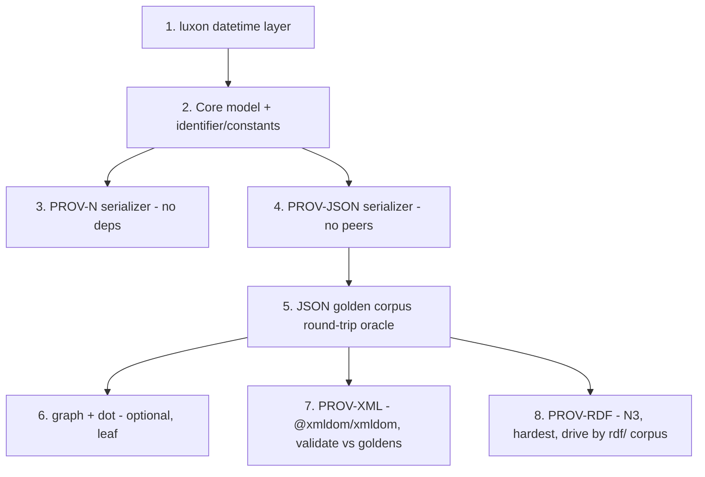

# 03 — Dependency Analysis

How the Python `prov` library (v2.1.1) integrates its third-party and stdlib dependencies, and what the TypeScript/Bun port should use in their place. This document is the dependency companion to [01-codebase-analysis.md](01-codebase-analysis.md), drives sequencing decisions in [02-migration-roadmap.md](02-migration-roadmap.md), and feeds the typing/runtime feasibility calls in [04-typescript-feasibility.md](04-typescript-feasibility.md).

All citations point at `reference/prov/src/prov/...` unless otherwise noted. Where a claim could not be confirmed in source it is marked **VERIFY**.

---

## 1. Overview & dependency table

`prov` declares only **three core** runtime dependencies and **two optional extras** in `pyproject.toml` (lines 31-44). Two of the three "core" deps (`networkx`, `pydot`) are actually leaf adapters used by single modules; the third (`python-dateutil`) is even flagged with a `# TODO: is this really needed?` comment (`pyproject.toml:36`). This is good news: the **core data model + PROV-JSON + PROV-N path has effectively zero hard third-party dependencies** once datetime parsing is handled.

| Dependency | pyproject decl | core/opt | Used by (module) | Why it exists | TS port risk |
|---|---|---|---|---|---|
| `networkx>=2.0` | `pyproject.toml:33` | core (leaf) | `graph.py` only | `MultiDiGraph` for `prov_to_graph`/`graph_to_prov` | **low** — 5 methods, no algorithms |
| `pydot>=1.2.0` | `pyproject.toml:35` | core (leaf) | `dot.py`; `scripts/convert.py:96`; `tests/test_dot.py` | Build Graphviz DOT graph; `.create()` shells out to `dot` binary | **medium** — build vs render split |
| `python-dateutil>=2.2` | `pyproject.toml:36` | core | `model.py:31,67,74`; `provrdf.py:11`; `provjson.py` (via `parse_xsd_datetime`) | Lenient `xsd:dateTime`/`gYear`/`gYearMonth` parsing | **medium** — offset/round-trip fidelity is load-bearing |
| `rdflib>=4.2.1,<7` | `pyproject.toml:41` (extra `rdf`) | optional | `provrdf.py` (entire file) | In-memory quad store + TRiG/Turtle (de)serialization | **high** — biggest port after the model |
| `lxml>=3.3.5` | `pyproject.toml:44` (extra `xml`) | optional | `provxml.py` (entire file) | DOM build/parse with per-node nsmap | **high** — namespace + pretty-print quirks |

Dev/tooling deps (`black`, `flake8`, `mypy`, `coverage`, `tox`, `sphinx`, `bumpversion`) are covered in the packaging doc; their TS analogues (biome/prettier, tsc strict, `bun test --coverage`, CI matrix, typedoc, `npm version`) live in the roadmap's M0 setup / §4 guardrails ([02-migration-roadmap.md](02-migration-roadmap.md)) and are out of scope here.

### Dependency → module → milestone map

```mermaid
flowchart LR
  subgraph core[Core - zero heavy deps]
    model[model.py]
    json[provjson.py]
    provn[provn.py]
  end
  subgraph dt[datetime layer]
    dateutil[python-dateutil]
  end
  subgraph opt[Optional extras]
    rdf[provrdf.py + rdflib]
    xml[provxml.py + lxml]
    graph[graph.py + networkx]
    dot[dot.py + pydot]
  end
  model --> dateutil
  json --> model
  provn --> model
  rdf --> model
  rdf --> dateutil
  xml --> model
  graph --> model
  dot --> graph
  dot --> model
```

The only dependency that touches the **core** path is `python-dateutil`. Everything else hangs off an optional or leaf module — which is exactly the seam the TS package should exploit (see §4, §5).

---

## 2. Per-dependency deep dive

### 2.1 networkx — `graph.py`

**API surface actually used** (the whole of it — `graph.py:1,67-105`):

| Python call | file:line | Purpose |
|---|---|---|
| `import networkx as nx` | `graph.py:1` | — |
| `nx.MultiDiGraph()` | `graph.py:67` | parallel-edge directed graph |
| `g.add_node(element)` | `graph.py:71` | node key is a **`ProvElement` object** |
| `g.add_edge(node_map[qn1], node_map[qn2], relation=relation)` | `graph.py:88` | single edge data attr `relation` |
| `g.nodes()` | `graph.py:102` | iterate node objects |
| `g.edges(data=True)` | `graph.py:105` | iterate `(u, v, edge_data_dict)` |

No traversal, shortest-path, layout, or any algorithm is used. The only semantic subtlety is that **nodes are full `ProvElement` objects used as hash keys**, which works in Python because `ProvRecord` defines value-based `__hash__`/`__eq__` (`model.py:297` / `model.py:528`). One caveat on that framing: it holds for record objects, but **`ProvDocument` itself is unhashable** — `model.py:1646` sets `__hash__ = None`, so the value-`__hash__` story applies to `ProvRecord`/`ProvElement` (`model.py:297`), not the document-level case. Note also that the real key type in `node_map` (`graph.py:72`) is the element's `QualifiedName` identifier, which carries value-based `__hash__`/`__eq__` (`identifier.py:99` for `__hash__`; `__eq__` inherited from `Identifier` at `identifier.py:35`) — reinforcing the recommendation below to key by `identifier.uri`. JS `Map`/`Set` key by reference, so the port **must key nodes by `identifier.uri`** and stash the object as node data (cross-ref the same hashing problem in [04-typescript-feasibility.md](04-typescript-feasibility.md)).

| Candidate | Fit | Maturity | Gaps / notes | 
|---|---|---|---|
| **DIY mini `MultiDiGraph`** | **diy (recommended)** | n/a | ~40 lines: `Map<string,ProvElement>` + `Array<{u,v,relation}>`. Zero deps, browser-safe, sidesteps the object-key mismatch entirely. The used surface is 5 methods. |
| `graphology` (`MultiDirectedGraph`) | close | high (most mature JS graph lib) | String-only node keys → key by `identifier.uri`; `relation` goes in edge attributes. `forEachNode`/`forEachEdge` iteration. Browser/bundler-friendly. |
| `@dagrejs/graphlib` | partial | medium (mostly a dagre dep) | `{directed:true, multigraph:true}`, `setNode`/`setEdge`/`nodes()`/`edges()`. String keys only. Less active than graphology. |
| `ngraph.graph` | partial | medium | Fast, supports multigraph + arbitrary link data, but its API and ecosystem are oriented toward layout/physics; overkill here. |

**Recommendation:** hand-roll the minimal `MultiDiGraph` to keep the (optional) graph module dependency-free and browser-safe, or use `graphology` if the project wants a graph type for other reasons. Either way, key nodes by `identifier.uri` and preserve the **"inferred node has `bundle == null`" sentinel** (`graph.py:82-84`) so `graph_to_prov` can skip synthetic endpoints (`graph.py:103`).

---

### 2.2 pydot — `dot.py` (+ CLI render path)

**API surface used** (`dot.py:53,206-394`):

| Python call | file:line | Purpose |
|---|---|---|
| `pydot.Dot(graph_type="digraph", rankdir=..., charset="utf-8")` | `dot.py:206` | root graph |
| `pydot.Cluster(graph_name=..., URL=...)` + `.set_label(...)` | `dot.py:251` | bundle → nested DOT cluster |
| `pydot.Node(node_id, label=..., URL='"%s"'%uri, **style)` | `dot.py:279,296` | styled node |
| `pydot.Node(bnode_id, label='""', shape="point", ...)` | `dot.py:304` | blank point node for n-ary relations |
| `pydot.Edge(src, dst, **style)` | `dot.py:247,363,374,385,394` | styled edge |
| `dot.add_node / add_edge / add_subgraph` | `dot.py:246,256,281,...` | assembly |
| `Dot.create(format=...)` | `scripts/convert.py:96`; `tests/test_dot.py` | **render** via external `dot` binary |
| `Dot.to_string()` | (implied) | emit DOT text |

Two distinct concerns are bundled in pydot and **must be split** in the port:

1. **Graph construction** (the core `prov_to_dot` logic): pure DOT-text generation. No native dependency.
2. **Rasterization** (`Dot.create(format=...)`): shells out to the Graphviz `dot` executable. Used **only** by the convert CLI and the dot test — never by `prov_to_dot` itself. Optional/system-dependent.

| Candidate | Concern | Fit | Notes |
|---|---|---|---|
| **`ts-graphviz`** | construction | **close (recommended)** | TS-native, active. `digraph()`, subgraph/cluster, `Node`/`Edge` with attribute objects, `toDot()`. Cluster nesting + HTML-like labels (the annotation `<TABLE>`) supported via raw/HTML-like label strings — covers everything `prov_to_dot` builds. |
| `@hpcc-js/wasm` | rasterization | partial | Graphviz compiled to WASM → renders **SVG** fully in-process, no native binary, browser-safe. **SVG-only** (no PNG/PDF directly). Strongly preferred for SVG output. |
| `@viz-js/viz` | rasterization | partial | Also WASM Graphviz → SVG; modern successor to viz.js. Same SVG-only caveat. |
| `@ts-graphviz/adapter` | rasterization | partial | Shells out to a local `dot` binary — same external-dependency story as pydot; **not browser-friendly**. Use when a native Graphviz install is acceptable and PNG/PDF are needed. |

**Recommendation:** target `ts-graphviz` for graph construction (a near-drop-in for the pydot build surface, bundler/browser-safe, emits DOT text). Keep rasterization an **optional extra**: `@hpcc-js/wasm` (or `@viz-js/viz`) for portable SVG; `@ts-graphviz/adapter` only when a local `dot` binary is acceptable for PNG/PDF. This mirrors prov, where pydot's dependence on the Graphviz executable is effectively optional (only the CLI/tests render). Note the manual-quoting and HTML-label quirks called out in the graph-dot analysis must be reproduced regardless of library (`dot.py:226-247,279,370-371`).

---

### 2.3 python-dateutil — `model.py` + serializers

**API surface used** — exactly one function, in three call sites:

| Python call | file:line | Purpose |
|---|---|---|
| `dateutil.parser.parse(value)` in `_ensure_datetime` | `model.py:67` | parse string time args for activity/generation/usage/start/end/invalidation |
| `dateutil.parser.parse(value)` in `parse_xsd_datetime` (try/except ValueError → None) | `model.py:74` | `XSD_DATATYPE_PARSERS` xsd:dateTime; feeds JSON decode |
| `dateutil.parser.parse(...)` for `xsd:dateTime`/`gYear`/`gYearMonth` RDF literals | `provrdf.py:219,222,226` | RDF datetime decode |

This is the **single most semantically load-bearing dependency to port correctly**, because byte-equivalent serialization across JSON/XML/RDF depends on (a) preserving the source UTC offset (`dateutil` returns tz-aware datetimes and re-emits the same offset via `.isoformat()`) and (b) sub-second precision. The `pyproject.toml:36` TODO confirms it is used only for lenient ISO-8601 parsing — prov never feeds it truly fuzzy strings, only XSD/ISO datetimes.

| Candidate | Fit | Notes |
|---|---|---|
| **`luxon`** | **close (recommended)** | `DateTime.fromISO(s, {setZone:true})` parses xsd:dateTime incl. `Z`/offsets and **preserves** the source zone; `.toISO()` reproduces `isoformat()`. Immutable, browser-safe. `setZone:true` is essential so it does not convert to local. `gYear`/`gYearMonth` parsed then reformatted by hand. |
| `Temporal` (TC39, via polyfill) | partial | `Temporal.ZonedDateTime`/`Instant` parse ISO-8601 precisely; the long-term native answer, available in Bun/Node via polyfill. More verbose; `Instant` normalizes to UTC so offset-preservation needs `ZonedDateTime`. Viable but higher friction today. |
| `date-fns` (+ `date-fns-tz`) | partial | `parseISO` handles ISO-8601 but the core lib has weak tz/offset preservation; needs `date-fns-tz` and careful handling. No clear advantage over luxon for this use. |
| native `Date` | **diy (insufficient)** | `Date.parse` handles a subset of ISO-8601 but **drops sub-second/offset fidelity** and has no `gYear`/`gYearMonth`. Acceptable only for a throwaway spike. |

**Recommendation:** adopt **luxon** as the internal time type. Centralize a `parseXsdDateTime()` / `toXsdDateTime()` pair mirroring `_ensure_datetime`/`parse_xsd_datetime` (`model.py:65,72`), using `fromISO(..., {setZone:true})` and `.toISO()`. Keep `parseXsdDateTime` returning `null` on failure (matching the `try/except ValueError → None` at `model.py:73-75`). The float/int → single `number` collapse is a **separate** but related fidelity problem (carry the datatype QName alongside the value) — see [04-typescript-feasibility.md](04-typescript-feasibility.md).

---

### 2.4 rdflib — `provrdf.py` (optional extra `rdf`)

`provrdf.py` (759 LOC) uses rdflib for **both** the in-memory triple/quad store **and** the concrete-syntax (de)serialization (TRiG default, plus Turtle etc.).

**API surface used** (`provrdf.py:13-16,125-160,...`):

| Python import / call | file:line | Purpose |
|---|---|---|
| `from rdflib.term import URIRef, BNode` | `provrdf.py:13` | RDF terms |
| `from rdflib.term import Literal as RDFLiteral` | `provrdf.py:14` | typed/lang literals (`.value`/`.datatype`/`.language`) |
| `from rdflib.graph import ConjunctiveGraph` | `provrdf.py:15` | quad-aware graph (named graphs = bundles) |
| `from rdflib.namespace import RDF, RDFS, XSD` | `provrdf.py:16` | `RDF.type`, `RDFS.label`, `XSD['dateTime']` |
| `graph.add((s,p,o))` / `.remove(...)` / `.triples((s,p,o))` | (encode/decode container) | triple add/remove/pattern query with `None` wildcards |
| `graph.serialize(buf, format='trig')` | `provrdf.py:144-154` | emit concrete RDF |
| `graph.parse(stream, format=...)` | (deserialize) | parse concrete RDF |
| `graph.contexts()` | (decode_document) | iterate named graphs (bundles) |
| `graph.bind(prefix, uri)` / `namespace_manager.compute_qname(uri)` | (encode/decode) | prefix binding + URI→qname |
| `io.BytesIO` round-trip + `isinstance(stream, io.TextIOBase)` | `provrdf.py:144,151` | text-vs-bytes stream handling |

| Candidate | Fit | Notes |
|---|---|---|
| **`N3` (Parser/Writer/Store) + RDF/JS DataFactory** | **close (recommended)** | `N3.Parser`/`N3.Writer` fully support Turtle, **TriG**, N-Triples, **N-Quads incl. named graphs** — a strong match for prov's TRiG default + bundle=named-graph model. `N3.Store` gives `.getQuads(s,p,o,g)` pattern matching, `addQuad`/`removeQuad`. Pair with `@rdfjs/data-model` (`namedNode`/`blankNode`/`literal`). Caveat: 2-3 packages, and you reimplement `compute_qname`/prefix-binding helpers yourself (small). |
| `rdflib` (npm, a.k.a. `rdflib.js`) | partial | Confusingly-named JS port. `Store`/`IndexedFormula`, `namedNode`/`literal`, `store.match()` (the `triples()` analog), `serialize()`/`parse()` for Turtle/N-Triples/JSON-LD. **Weaker TRiG/quad/named-graph (`contexts()`) support**; dated, callback-flavored API. |
| `@rdfjs/*` ecosystem (`data-model`, `dataset`, `namespace`) + `jsonld` | partial | RDF/JS standard `Term`/`Quad`/`Dataset` + prefix handling; most idiomatic/modern, but you assemble several pieces and **TRiG specifically comes from N3, not this set**. Add `jsonld` if JSON-LD output is wanted. |
| `rdf-ext` | partial | Convenience layer over RDF/JS; still leans on N3 for TriG parsing/serialization. |

**No single package is a drop-in for rdflib.** The encode/decode mapping logic (`encode_container` at `provrdf.py:261`, `decode_container` at `provrdf.py:531`) is **prov-specific, not rdflib magic** — the enormous nested predicate remapping, `prov:qualifiedX` BNode generation, ALTERNATE subject/object swap, and `getattr(bundle, RELATION_MAP[pred])(...)` dynamic dispatch must be ported by hand regardless of which RDF lib backs the triple store. Replace the `getattr` dispatch with an explicit `Record<string, (bundle, ...args) => void>` table (RELATION_MAP/PREDICATE_MAP at `provrdf.py:83,100`).

**Recommendation:** keep RDF an **optional peer/extra** (mirrors prov's `rdf` extra). Target **`N3` + RDF/JS DataFactory** for first-class quad/TRiG/named-graph support. This is the heaviest, most error-prone port after the core model — drive it with the golden `rdf/` corpus (402 files = 398 `.ttl` + 4 `.trig`) and a graph-isomorphism comparator (port of `find_diff`, `tests/test_rdf.py:24`), not string equality. Defer until JSON + PROV-N are solid (§5).

---

### 2.5 lxml — `provxml.py` (optional extra `xml`)

`provxml.py` (433 LOC) builds an lxml etree on serialize and walks a parsed tree on deserialize.

**API surface used** (`provxml.py:4,68-359`):

| Python call | file:line | Purpose |
|---|---|---|
| `from lxml import etree` | `provxml.py:4` | — |
| `etree.Element(tag, nsmap=...)` / `etree.SubElement(parent, tag, attrs, nsmap=...)` | `provxml.py:120,124,143,146` | build elements with per-node nsmap |
| `etree.ElementTree(root)` + `.write(stream, pretty_print=True, xml_declaration=True, encoding="UTF-8")` | `provxml.py:68,76` | serialize |
| `etree.tostring(et, xml_declaration=True, pretty_print=True)` | `provxml.py:71` | serialize to bytes |
| `etree.parse(stream).getroot()` | `provxml.py:245,247` | parse |
| `etree.QName(element)` → `.namespace`/`.localname` | `provxml.py:272,359` | Clark-notation `{uri}local` |
| `element.nsmap` (incl. `None` default key) | `provxml.py` (xml_qname_to_QualifiedName) | **per-node in-scope namespace map** — critical |
| `element.attrib` / `element.text` / `element.prefix` | (extract) | attribute/text access |
| `xml_doc.xpath("//comment()")` then `parent.remove(child)` | `provxml.py:250` | strip comments |

| Candidate | Fit | Notes |
|---|---|---|
| **`@xmldom/xmldom` + (`xpath` optional)** | **close (recommended)** | DOM-standard parse/serialize (`DOMParser`/`XMLSerializer`) with namespace support via `createElementNS`/`setAttributeNS` and `lookupNamespaceURI`/`lookupPrefix` (covers per-node nsmap reads). Replace `xpath('//comment()')` with a plain `childNodes` walk dropping `COMMENT_NODE` (drops the `xpath` dep). Pure-JS, browser/bundler-safe. Gaps: no built-in pretty-print (small indenter needed) and no `.nsmap` dict (derive via DOM namespace lookups). |
| `fast-xml-parser` | partial | Very popular, fast, browser-safe, but **parse-to-object / build-from-object**, not a DOM. Namespace + mixed prefix/Clark-notation control is coarser; reproducing per-element nsmap and `xsi:type`/`prov:ref` placement is awkward. Usable if you rewrite the serializer around its object model. |
| `libxmljs2` (native libxml2) | drop-in (semantically) | Closest to lxml (it *is* libxml2): XPath, namespaces, pretty-print first-class. **Native addon** → not browser-friendly, complicates bundling, historically lags on prebuilt binaries. Acceptable for a Node-only build, contradicts browser goals. |
| `sax` / `saxes` | partial | Streaming parser only; you build your own tree + nsmap tracking. More work, but full control over namespace scoping. Pair with a hand-written writer for serialize. |

**Recommendation:** keep XML an **optional module** (mirrors prov's `xml` extra). Target **`@xmldom/xmldom`** for a faithful, browser-safe DOM port; replace the comment-strip xpath with a `childNodes` filter on `COMMENT_NODE`. Budget for a small custom **prefix-resolution + indentation helper** — the genuinely hard parts are namespace handling (per-element in-scope nsmap reads in `xml_qname_to_QualifiedName`, writing nsmap on root/`bundleContent`, the xsd-uri trailing-`#` stripping at `provxml.py:111-117`) and pretty-printing. **Avoid native libxml bindings.** Note that **PROV-XML round-trip is not structurally stable** (the Python test injection is disabled, `tests/test_xml.py:406`) — validate only against curated `example_06/07/08` goldens via a c14n-style canonical diff (`compare_xml`, `tests/test_xml.py:34`), not byte equality.

---

### 2.6 Honest "no good parallel" summary

| Capability | Best TS option | Reality |
|---|---|---|
| Value-hashed graph nodes (networkx) | DIY / graphology | Trivial to replace; key by `uri`. |
| Graphviz render to PNG/PDF | `@ts-graphviz/adapter` (binary) | No pure-JS path for PNG/PDF; WASM is SVG-only. Treat as optional/Node-only. |
| Lenient `xsd:dateTime` parse | luxon | Good fit; only risk is exact offset/sub-second round-trip parity. |
| Full RDF lib (`rdflib`) | N3 + RDF/JS | **No drop-in.** Assemble 2-3 packages; port all prov-specific mapping by hand. |
| lxml DOM with per-node nsmap | `@xmldom/xmldom` | Close, but nsmap + pretty-print + PROV-XML round-trip instability make it the second-riskiest port. |

---

## 3. Python stdlib usage → TS strategy

Per `CLAUDE.md`, prefer Bun APIs (`Bun.file`, `Bun.write`, `bun:test`) and native web APIs (`URL`, `JSON`, `Map`, `structuredClone`, `TextEncoder`) over Node-specific or third-party equivalents.

| stdlib module | Used for (file:line) | TS / Bun strategy |
|---|---|---|
| `datetime` + `dateutil.parser` | xsd:dateTime/gYear/gYearMonth across `model.py:67,74`, `provrdf.py:219`, `provjson.py` | **luxon** internal time type; `fromISO(s,{setZone:true})` + `.toISO()`; `parseXsdDateTime`→`null` on failure. Do **not** use bare `Date` (loses offset/sub-second). |
| `io` / `io.IOBase` / `TextIOBase` | `Serializer.serialize/deserialize(stream)`; `model.py:2729,2733,2784,2790`; every serializer | **Redesign the interface around `string`/`Uint8Array`**: `serialize() → string | Uint8Array`, `deserialize(input: string | Uint8Array)`. The text-vs-bytes `isinstance` branching collapses into a typed return. `TextEncoder`/`TextDecoder` for the utf-8 boundary. Browser-safe. |
| `io.StringIO` / `io.BytesIO` | buffers in serialize/deserialize (`model.py:2446,2729`; `provrdf.py:144`) | Plain string concatenation / `Uint8Array`. No buffer abstraction needed. |
| `urllib.parse.urlparse` | `model.py:2738` reject non-local destination (`netloc != ''`) before write | WHATWG **`new URL(loc)`** (global in Bun/Node/browser): inspect `.host`/`.protocol`. Most of this branch can be dropped once file I/O goes through `Bun.write`. |
| `collections.defaultdict` | `defaultdict(set)` attrs (`model.py:293`); `defaultdict(list)` id-map (`model.py:1396`); `defaultdict(dict)` (`provjson.py:136`) | Tiny `getOrInit(map, key, () => new Set()/[]/{})` helper, or a small `MultiMap` class. **Avoid auto-vivifying on read** (don't reproduce the empty-key side effects unless a consumer depends on them — see [01](01-codebase-analysis.md)). |
| `collections.OrderedDict` | `provrdf.py:582,585` formal-attribute ordering | Native `Map` (preserves insertion order). |
| `itertools` | `itertools.chain` in flatten/unify (`model.py:2585,2588`) | `[...a, ...b]` / `function*` generator. No dep. |
| `html.escape` | `dot.py:231,233` HTML-like TABLE labels | 5-replacement DIY helper (`& < > " '`) matching `escape(quote=True)`, or reuse `ts-graphviz`'s HTML-label handling. |
| `base64` | `provrdf.py:215,754` xsd:base64Binary | Bun/Node: `Buffer.from(bytes).toString('base64')` / `Buffer.from(s,'base64')`. Browser-portable core: `btoa`/`atob` or `Uint8Array.toBase64()`. Keep inside the optional RDF module. |
| `json` (+ `JSONEncoder`/`Decoder` subclasses) | `provjson.py` | Native `JSON.parse`/`JSON.stringify`. **No encoder/decoder subclass concept** — write explicit `document → plain object` (toJSON-style) and `parsed → document` (fromJSON) functions. Cleaner than Python's `cls=` hooks. |
| `argparse` | `scripts/convert.py`, `scripts/compare.py` (CLI only) | `util.parseArgs` (Bun/Node built-in, zero deps) for the simple flag set; `commander`/`cac` if richer help wanted. `FileType` auto-open → `Bun.file(path)`. Keep CLIs in a separate entrypoint. |
| `abc` / `@abstractmethod` | `serializers/__init__.py:16` `Serializer` ABC | Native TS `interface` or `abstract class` (compile-time enforced). No runtime ABC machinery. |
| `tempfile` / `shutil` | `model.py:2744-2752` atomic write (mkstemp + move/copy) | Drop from browser core. `Bun.write(path, content)` for the common case; if atomicity is wanted, temp path + `node:fs/promises rename`. Confine to the Node/Bun build. |
| `warnings` | `provrdf.py:705`, `provxml.py:279,377`, `ProvWarning` classes | No native equiv. Default `console.warn`; **better**: an optional `onWarning` callback so consumers can capture structured warnings. `ProvWarning` (a Python `Warning` subclass) has no TS analogue — emit via the callback, don't model a class. |
| `logging` | `model.py:41` + serializers + scripts | Minimal **injectable logger interface** (`debug/info/warn/error`) defaulting to no-op (or `console`). Do **not** pull pino/winston into the core (Node-oriented, heavy). |
| `os.PathLike` / file detection | `read()` type hints; serialize/deserialize | `string` path + `Bun.file`. `structuredClone` available for deep copies where the port needs them. |

---

## 4. Optional-dependency strategy in TS

The goal: **core (`model` + PROV-JSON + PROV-N) installs with zero heavy deps** (only luxon, ~tiny). XML, RDF, graph, and dot are gated behind subpath exports + optional peers, and dynamically imported so they never enter the core bundle or browser builds.

### Mechanism comparison

| Mechanism | Use it for | Pro | Con |
|---|---|---|---|
| `dependencies` | `luxon` only | Always installed; core needs it | Pulled by everyone |
| `optionalDependencies` | — (avoid) | npm won't fail if install fails | Still **installed by default**; doesn't make it "opt-in" |
| `peerDependencies` + `peerDependenciesMeta.optional` | `n3`, `@xmldom/xmldom`, `ts-graphviz`, `@hpcc-js/wasm`, `graphology` | Consumer explicitly opts in; no version duplication; not auto-installed | Consumer must add them; needs clear docs/error |
| **subpath `exports`** (`./rdf`, `./xml`, `./dot`, `./graph`) | the feature modules | Tree-shakeable; core import never touches them; clean public API | Requires disciplined module boundaries |
| **dynamic `import()`** inside the feature module | lazy-loading the heavy peer | Heavy dep loads only when feature is called; mirrors prov's lazy imports (`model.py:2402` plot, `convert.py:96` dot) | Async boundary; the feature entrypoint becomes async |

**Recommendation:** combine **subpath exports** (so `import {ProvDocument} from 'tsprov'` never reaches xml/rdf code) + **optional peer dependencies** (so `n3`/`@xmldom/xmldom`/`ts-graphviz` are opt-in) + a **dynamic `import()`** inside each feature module that throws a clear "install `n3` to use the RDF serializer" error if the peer is missing (the typed `DoNotExist` analog, mirroring `serializers/__init__.py:49`; the closest "not supported" signal in prov is the `NotImplementedError` raised by `ProvNSerializer.deserialize`, `provn.py:32`).

### package.json sketch

```jsonc
{
  "name": "tsprov",
  "type": "module",
  "sideEffects": false,
  "exports": {
    ".":        { "types": "./dist/index.d.ts",        "import": "./dist/index.js",        "require": "./dist/index.cjs" },
    "./provn":  { "types": "./dist/serializers/provn.d.ts", "import": "./dist/serializers/provn.js" },
    "./json":   { "types": "./dist/serializers/json.d.ts",  "import": "./dist/serializers/json.js" },
    "./xml":    { "types": "./dist/serializers/xml.d.ts",   "import": "./dist/serializers/xml.js" },
    "./rdf":    { "types": "./dist/serializers/rdf.d.ts",   "import": "./dist/serializers/rdf.js" },
    "./graph":  { "types": "./dist/graph.d.ts",  "import": "./dist/graph.js" },
    "./dot":    { "types": "./dist/dot.d.ts",    "import": "./dist/dot.js" }
  },
  "bin": {
    "prov-convert": "./dist/cli/convert.js",
    "prov-compare": "./dist/cli/compare.js"
  },
  "dependencies": {
    "luxon": "^3"
  },
  "peerDependencies": {
    "@xmldom/xmldom": "^0.9",
    "n3": "^1",
    "ts-graphviz": "^2",
    "@hpcc-js/wasm": "^2",
    "graphology": "^0.25"
  },
  "peerDependenciesMeta": {
    "@xmldom/xmldom": { "optional": true },
    "n3":             { "optional": true },
    "ts-graphviz":    { "optional": true },
    "@hpcc-js/wasm":  { "optional": true },
    "graphology":     { "optional": true }
  }
}
```

Inside `./rdf`:

```ts
// dist/serializers/rdf.ts (conceptual)
export async function getRdfSerializer() {
  let N3: typeof import("n3");
  try { N3 = await import("n3"); }
  catch { throw new ProvError("The 'rdf' serializer requires the optional peer dependency 'n3'. Run: bun add n3"); }
  return new ProvRDFSerializer(N3);
}
```

The PROV-N serializer needs **no** peer (it just calls `document.get_provn()`, `provn.py:24` — `getProvN()` is the proposed TS rename) and PROV-JSON needs only the core + constants maps — so both ship in core. This matches the priority order in [02-migration-roadmap.md](02-migration-roadmap.md): JSON + PROV-N first.

---

## 5. Risk assessment & sequencing implications

| Dependency | Risk | Blocks | Defer? |
|---|---|---|---|
| `python-dateutil` → **luxon** | medium | Core model, **all** serializers (datetime fidelity), all round-trip tests | **No** — do first; it gates correctness of every format. |
| `networkx` → DIY/graphology | low | `graph` module only | Yes — leaf feature, after core. |
| `pydot` → ts-graphviz | medium | `dot` module; convert CLI graphical output | Yes — and split render (further optional). |
| `rdflib` → N3 + RDF/JS | **high** | `rdf` serializer; RDF round-trip + json→ttl differential tests | Yes — last serializer. Heaviest port after the model. |
| `lxml` → @xmldom/xmldom | **high** | `xml` serializer; XML golden tests | Yes — after JSON; round-trip is one-way (validate vs goldens only). |

### Recommended sequence (dependency-driven)



1. **luxon first** — datetime is the only core-path dependency and the load-bearing correctness factor.
2. **Core model + PROV-N + PROV-JSON** ship with **zero heavy peers**; this is the MVP that exercises every record type via the `json/` golden corpus (398 files) using the timestamp-safe "parse golden → re-serialize → deep-equal" strategy from the tests analysis. Note that **PROV-N is serialize-only**: `ProvNSerializer.deserialize` raises `NotImplementedError` (`provn.py:32`). JSON, XML, and RDF all implement a real `deserialize` (`provjson.py:86`, `provxml.py:234`, `provrdf.py:158`), so only PROV-N lacks a parse path.
3. **graph/dot** are independent leaf adapters — schedule whenever, behind `./graph`/`./dot`.
4. **PROV-XML** before PROV-RDF (lower LOC, `@xmldom/xmldom` is closer to lxml than N3 is to rdflib), but accept its **one-way round-trip** reality (`tests/test_xml.py:406`).
5. **PROV-RDF last** — biggest surface (759 LOC of prov-specific mapping), assemble N3 + RDF/JS, port `RELATION_MAP`/`PREDICATE_MAP` dispatch and `walk` (`provrdf.py:711`) carefully, drive entirely by the `rdf/` golden corpus + a `find_diff` graph-isomorphism comparator.

The **expected-loss sets** (RDF can't round-trip scruffy duplicate-id records or some literal sets; XML can't round-trip namespace edge files) are documented as `@unittest.expectedFailure`/disabled-injection in the Python suite — replicate them as named exclusions, not bugs (cross-ref [tests analysis] and [04-typescript-feasibility.md](04-typescript-feasibility.md)).

---

## 6. Bundling & packaging concerns

The target (per the ground-truth project description) publishes **dual ESM + CJS with `.d.ts`** via `bun build` (js/cjs) + `tsc` (types), under a strict tsconfig (`noUncheckedIndexedAccess`, `verbatimModuleSyntax`).

| Concern | Approach | Why |
|---|---|---|
| **Dual ESM+CJS** | `exports` with `import`/`require` conditions per subpath (see §4 sketch). Build `.js` (ESM) + `.cjs` (CJS) + `.d.ts`. | Consumers on either module system; `verbatimModuleSyntax` keeps import/export forms explicit. |
| **Tree-shaking** | `"sideEffects": false`; pure modules; **no top-level mutable registry side effects** that import the heavy serializers. | The Python `Registry.load_serializers()` lazy-import singleton (`serializers/__init__.py:62`; `Registry` class spans `serializers/__init__.py:55-87`) exists to break import cycles and avoid loading lxml/rdflib eagerly — replicate that *intent* with subpath exports + dynamic import, **not** a global mutable registry, so bundlers can drop unused formats. |
| **Core stays heavy-dep-free** | Only `luxon` in `dependencies`. xml/rdf/dot/graph behind optional peers + dynamic `import()`. | A consumer using only JSON/PROV-N ships ~core + luxon; never pulls N3/xmldom/ts-graphviz. |
| **Browser vs Node** | `exports` **conditions** (`"browser"`, `"node"`, `"default"`) where a module has a Node-only path. Keep `Bun.write`/`tempfile`/`fs` strictly in CLI + a `"node"`-conditioned file-IO helper; the serializers return `string`/`Uint8Array` and never touch the filesystem. | The §3 stream redesign makes serializers browser-safe; only file persistence (CLI) is Node-only. |
| **CLI isolation** | `bin` entries point at `./dist/cli/*.js` (separate from the library barrel). | Argparse/file-IO/process concerns never enter the library bundle (mirrors `[project.scripts]` separation). |
| **Native deps stay out** | Prefer pure-JS/WASM peers (`@xmldom/xmldom`, `@hpcc-js/wasm`); gate native ones (`@ts-graphviz/adapter`, `libxmljs2`) behind a clearly-documented Node-only render extra. | Preserves bundler/browser usability; no node-gyp in the default install. |
| **Single version source** | package.json `version` is the source of truth; re-export as a generated constant for the `--version` flag. | Replaces setuptools' `dynamic version from prov.__version__` (`pyproject.toml:63`); one place to bump. |

### Bundle-tier summary

| Install tier | Deps pulled | Formats available |
|---|---|---|
| `tsprov` (core) | `luxon` | PROV-N (serialize), PROV-JSON (both) |
| `+ @xmldom/xmldom` | + DOM | PROV-XML |
| `+ n3` | + N3/RDF-JS | PROV-RDF |
| `+ ts-graphviz` | + DOT builder | `prov_to_dot` → DOT text |
| `+ @hpcc-js/wasm` | + WASM Graphviz | DOT → SVG render (browser-safe) |
| `+ @ts-graphviz/adapter` | + native `dot` | DOT → PNG/PDF (Node-only) |

This keeps the common case (the W3C PROV authoring API + JSON/PROV-N round-trip) lean and browser-friendly, while the spec-completeness formats (XML/RDF) and visualization (graph/dot) are strictly opt-in — faithfully mirroring prov's own core-vs-extras split (`pyproject.toml:32-44`) but using TS-idiomatic subpath exports and optional peers instead of Python's lazy-import Registry.
