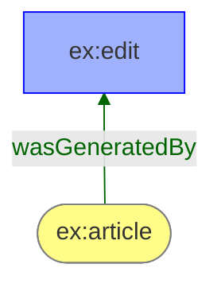

# @inflexa-ai/tsprov-render-mermaid

A [Mermaid](https://mermaid.js.org/) renderer for
[`@inflexa-ai/tsprov`](https://www.npmjs.com/package/@inflexa-ai/tsprov) provenance
documents. `MermaidRenderer` turns a `ProvDocument` into a `flowchart` string in the
W3C PROV visual language — stadium entities, rect activities, hexagon agents, labeled
and colored edges, n-ary relations routed through blank nodes, attribute annotations,
and bundles as subgraphs. Paste the string into any GitHub, GitLab, Obsidian, or
Markdown-with-Mermaid surface and it renders **with zero tooling** — no Graphviz, no
build step.

It carries **zero third-party weight**: its only runtime dependency is the
value-semantic sibling [`@inflexa-ai/tsprov-render-core`](https://www.npmjs.com/package/@inflexa-ai/tsprov-render-core),
and `tsprov` is a **peer** (installed once, shared by every renderer).

## Usage

```ts
import { ProvDocument } from "@inflexa-ai/tsprov";
import { MermaidRenderer } from "@inflexa-ai/tsprov-render-mermaid";

const doc = ProvDocument.deserialize(json, "json");
const mermaid = new MermaidRenderer().render(doc);
//    ^ a Mermaid flowchart string
```

Embed it in a GitHub Markdown file by wrapping it in a ` ```mermaid ` fence:

````markdown

````

`render(doc, options?)` is **deterministic**: the same document and options produce a
byte-identical string every time. It projects the document through the render-core
scene once and then reads only the scene — the output is a pure function of scene data.

## Options

`MermaidRenderOptions` extends the shared `RendererOptions` (the scene projection
toggles + a `theme` override) with a Mermaid-specific `direction`:

```ts
new MermaidRenderer().render(doc, {
  direction: "LR",                    // flowchart direction: "BT" (default) | "TB" | "LR" | "RL"
  useLabels: true,                    // use prov:label as node text (two-line label)
  showNary: true,                     // route n-ary relations through a blank node
  includeElementAttributes: true,     // element attributes as annotation rects
  includeRelationAttributes: true,    // relation attributes as annotation rects
  theme: {                            // partial PROV_THEME override, merged per section
    nodes: { ...PROV_THEME.nodes, entity: { ...PROV_THEME.nodes.entity, fillcolor: "#e0f0ff" } },
  },
});
```

| Option | Default | Effect |
| --- | --- | --- |
| `direction` | `"BT"` | Flowchart direction. An out-of-range value (only reachable from untyped JS) falls back to `"BT"`. |
| `useLabels` | `false` | Node text is `prov:label`; when it differs from the identifier, a two-line label with the identifier as a `<br/>` subtitle. |
| `showNary` | `true` | Extra n-ary endpoints are drawn as gray legs off a shared blank node. |
| `includeElementAttributes` | `true` | An element's non-formal attributes become a gray annotation rect linked to it. |
| `includeRelationAttributes` | `true` | A relation's non-formal attributes become an annotation rect linked to the relation's blank node. |
| `theme` | `PROV_THEME` | A `Partial<ProvTheme>` merged over the reference theme, shallow per section and per entry (so an override can touch a single field). |

## What it draws

- **Nodes** — one per scene node: a stadium entity, rect activity, or hexagon agent in
  the reference colors, each with a `:::kind` classDef. Endpoints inferred from a
  relation (not declared) get the gray generic class.
- **Edges** — one labeled edge per binary relation, tinted with the relation's theme
  color via an index-aligned `linkStyle`.
- **N-ary relations** — split through a small circle blank node: the first segment is an
  arrowless open link (`---`) keeping the label, the second a plain arrow with no label,
  and extra endpoints are gray legs labeled with the endpoint's role.
- **Annotations** — non-formal attributes become a gray rect with `<br/>`-joined
  `name = value` rows, joined by a dotted, arrowless link (`-.-`).
- **Bundles** — each sub-bundle is a `subgraph` titled with the bundle identifier.
- **Links** — every node with a URI gets a `click … href "…" _blank` link. Surfaces
  that strip interactions (GitHub) simply ignore them.

## Shape approximations vs `prov.dot` (D19)

Mermaid has a fixed shape vocabulary with no `house`, `folder`, `point`, or `note`, so
the PROV convention is mapped to the honest best fits: **agent → hexagon** (not house),
**bundle endpoint → subroutine** `[[…]]` (not folder), the **n-ary/annotation join → a
tiny circle** (not a point), and the **annotation → a plain rect** (not a note box).
Structure — which nodes and edges exist, and when a relation splits through a blank
node — is byte-for-byte identical to the DOT renderer (the same D18 information-content
rule). The theme stays Graphviz-faithful as the single source of truth; the emitter owns the
CSS surface, so a Graphviz-only color name that is not valid CSS (currently only `red4`,
the `used` line color) is projected to its X11 hex (`red4` → `#8B0000`) at emission time
via `toCssColor` — the stroke survives in a browser instead of being dropped by its CSS
parser. See the repository's `DEVIATIONS.md` (D19).

## Skipped relations are enumerable, not silently absent (D15)

A relation whose first two formal endpoints are not both resolvable (e.g. `wasStartedBy`
with no activity) cannot be drawn as an edge. Following the scene, this renderer omits
it — but the omission is not silent: `toRenderScene(doc).skipped` enumerates every such
relation with its type, identifier, and reason:

```ts
import { toRenderScene } from "@inflexa-ai/tsprov-render-core";
const { skipped } = toRenderScene(doc);
// [{ relation: "prov:Start", identifier: "ex:start1", reason: "…" }, …]
```

This is deviation **D15** (see `DEVIATIONS.md`).

## Install

```sh
bun add @inflexa-ai/tsprov @inflexa-ai/tsprov-render-mermaid
# or: npm install @inflexa-ai/tsprov @inflexa-ai/tsprov-render-mermaid
```

`tsprov` is a peer dependency (`>=0.5.1 <2`); `@inflexa-ai/tsprov-render-core` comes in
automatically (it is a regular dependency of this package, not one you install yourself).
The package ships a dual **ESM + CJS** build with `.d.ts` declarations, consumable
under both `moduleResolution: bundler` and `nodenext`/`node16`.

## License

Apache-2.0. Part of the [tsprov](https://github.com/inflexa-ai/tsprov) project.
